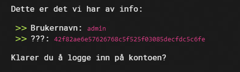
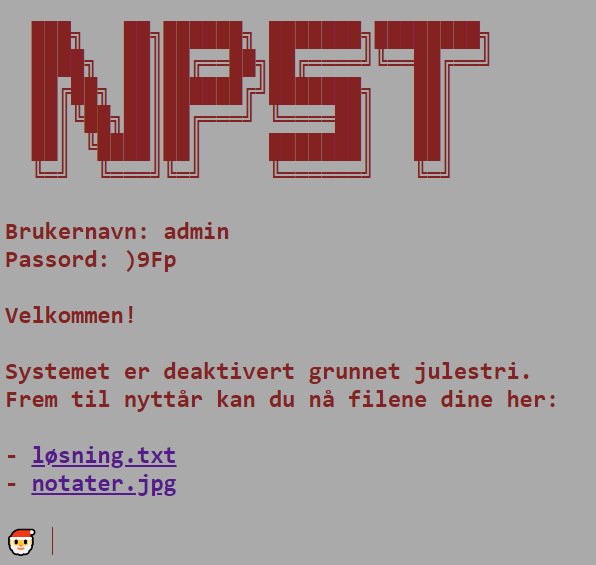
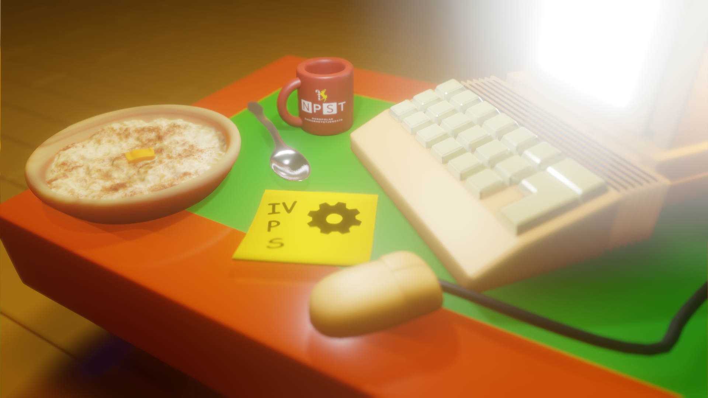

# Passordgjenoppretting

## Oppgaven

    En tidligere ansatt måtte slutte etter å ha endt opp på listen over slemme barn. Dessverre glemte vi å be han kopiere ut filene sine før han sluttet, og vi har følgelig ikke passordet.

    Dette er det vi har av info:

    Brukernavn: admin
    ???: 42f82ae6e57626768c5f525f03085decfdc5c6fe

    Klarer du å logge inn på kontoen?



---

## Løsningen

### Steg 1

Vi antar at cipheret som er oppgitt er en SHA-1-hash basert på lengden og innhold.

Siden vi allerede vet hashen, og passord-formatet til NPST, kan vi bruteforce alle passord som i oppgave #2 og kalkulere SHA-1-hashen for hver av disse. Vi kan da sammenligne hver genererte hash med hashen oppgitt i oppgaven.

Når vi finner en hash som matcher så har vi passordet.  
Vi endrer bittelitt på programmet vi lagde i oppgave 2 for å gjøre denne oppgaven.

```javascript
const crypto = require("crypto");

// Create arrays of allowed characters in ASCII-table-order
var signs = [..."!#%&()*"];
var number = [..."0123456789"];
var signs2 = [..."@"];
var upper = [..."ABCDEFGHIJKLMNOPQRSTVUWXYZ"];
var signs3 = [..."^"];
var lower = [..."abcdefghijklmnopqrstuvwxyz"];
var signs4 = [..."{}~"];

// Make the valid combos ready
var combo = [signs, number, upper, lower];
var combo2 = [number, signs2, upper, lower];
var combo3 = [number, upper, signs3, lower];
var combo4 = [number, upper, lower, signs4];

// Make an array of all valid combos of combos
var comboOfCombos = [combo, combo2, combo3, combo4];

// Recursive function to generate (almost) valid passwords
const generatePasswords = (arrays, arrayIndex) => {
    if (arrayIndex === arrays.length - 1) return arrays[arrayIndex].map(c => "" + c);

    let passwords = [];

    for (var i = 0; i < arrays[arrayIndex].length; i++) {
        var password = "" + arrays[arrayIndex][i];
        var newPasswords = generatePasswords(arrays, arrayIndex + 1);

        if (newPasswords && newPasswords.length > 0) {
            passwords = [...passwords, ...newPasswords.map(newPassword => password + newPassword)];
        } else {
            passwords.push(password);
        }
    }

    return passwords;
};

const targetHash = "42f82ae6e57626768c5f525f03085decfdc5c6fe";

// Iterate over all valid combos and generate (almost) valid passwords
for (var combo of comboOfCombos) {
    var generatedPasswords = generatePasswords(combo, 0);

    // Iterate over all generated passwords
    for (var password of generatedPasswords) {
        // Create a SHA-1 hash of our generated password
        const sha1 = crypto.createHash("sha1");
        const sha1Hash = sha1.update(password).digest("hex");

        // Compare it with the known password hash
        if (sha1Hash == targetHash) {
            console.log(password);
            return;
        }
    }
}
```

Output

```text
Username: admin
Password: )9Fp
```

Når vi skriver inn brukernavnet og passordet får vi link til en txt-fil og et bilde.



Txt-filen inneholder flagget.

```text


███████╗██╗      █████╗  ██████╗  ██████╗
██╔════╝██║     ██╔══██╗██╔════╝ ██╔════╝ ██╗
█████╗  ██║     ███████║██║  ███╗██║  ███╗╚═╝
██╔══╝  ██║     ██╔══██║██║   ██║██║   ██║██╗
██║     ███████╗██║  ██║╚██████╔╝╚██████╔╝╚═╝
╚═╝     ╚══════╝╚═╝  ╚═╝ ╚═════╝  ╚═════╝

PST{36044221cd3e991ffc56eb2f1e368ca0}
```

```json
Flagg: PST{36044221cd3e991ffc56eb2f1e368ca0}
```

---

## Easter egg


