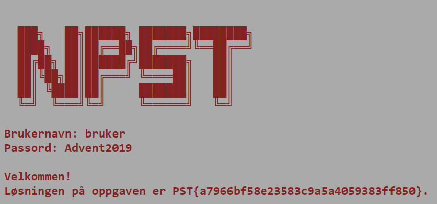

# Velkommen til NPST

## Oppgaven

    Se dagsbriefen: https://kalender.npst.no/01

<p><em>Dagens dagsbrief utgår til fordel for praktisk informasjonsskriv til nyansatte alvebetjenter. Vi forventer at alle adventsvikarene leser denne nøye.</em></p><p><strong>Adventsvikarene våre er endelig på plass, velkommen! 🎅</strong></p><p>NPSTs morgenbrief blir publisert hver dag på <a href=\"https://kalender.npst.no\">https://kalender.npst.no</a>. Gjennom disse briefene kan man følge med på tjenestens indre liv, og hvilke trusler mot nissens verksted og kjerneverdier som lusker rundt der ute.</p><p>Det er primært behov for adventsvikarene sin EDB-kompetanse på søndager, men det forventes at dere følger med på morgenbriefene også øvrige dager.</p><p>De dagene det blir ytret ønske om din ekspertise, trenger vi at du svarer i NPSTs intranett. Svarene vi ofte er på jakt etter pleier å være på formen PST{noenTilfeldigeBokstaver}. Avvik vil tydelig annonseres. For å kunne legge inn besvarelser der må du opprette en bruker. Pass på å benytte en epost der det er mulig å kontakte deg dersom du ønsker å delta i kåringene ukens ansatt og årets alvebetjent (se praktisk info lenger nede).</p><p>Intranettet finner man her: <a href=\"https://intranett.npst.no\">https://intranett.npst.no</a>.</p><p>Etter du har laget deg en bruker i intranettet trenger vi også at du logger deg på et litt eldre system du finner her: <a href=\"https://login.npst.no\">https://login.npst.no</a>. Vi har ikke helt fått klarhet i hva dette systemet brukes til, men vi tror du skal kunne logge inn med følgende brukernavn og passord:</p><p>Brukernavn: <code>bruker</code><br>Passord: <code>Advent2019</code></p><p>Etter du har logget inn trenger vi at du legger inn det du finner i intranettet: <a href=\"https://intranett.npst.no/challenges\">https://intranett.npst.no/challenges</a></p><p><strong>Praktisk info</strong></p><p>Alle vikariatsansatte alver er med i kåringen <em>Ukens Ansatt</em>; en kåring der de flittigste alvene får en påskjønnelse. Flittighetsberegningen av alvebetjenter er veldig avansert, bestående av både tilfeldighet og oppgavebesvarelser. Ukens Ansatt blir kåret hver fredag i advent, og publisert på <a href=\"https://intranett.npst.no\">intranettet</a>. Vinnere blir kontaktet per elektronisk post som er registrert på <a href=\"https://intranett.npst.no\">intranettet</a>.</p><p>Når julestria har lagt seg vil en liknende beregningsmodell bli brukt for å kåre <em>Årets Alvebetjent</em>. Dette er en meget gjev og anerkjent tittel, som vinneren kan smykke seg med livet ut. Vinneren av Årets Alvebetjent blir kontaktet per elektronisk post som er registrert på <a href=\"https://intranett.npst.no\">intranettet</a> innen utgangen av Januar 2020.</p><p>Elektroniske postadresser som registreres på <a href=\"https://intranett.npst.no\">intranettet</a> vil kun bli brukt for å kontakte vinnere av konkurransene nevnt over. Dersom vinnere ikke svarer på henvendelser innen 1 uke, vil en ny vinner utpekes.</p><p>Vennlig hilsen,<br>Jule Nissen</p>

---

## Løsningen

Brukernavn og passord er oppgitt i oppgaveteksten  
Logg inn med

```text
Brukernavn: bruker
Passord: Advent2019
```



```json
PST{a7966bf58e23583c9a5a4059383ff850}
```
