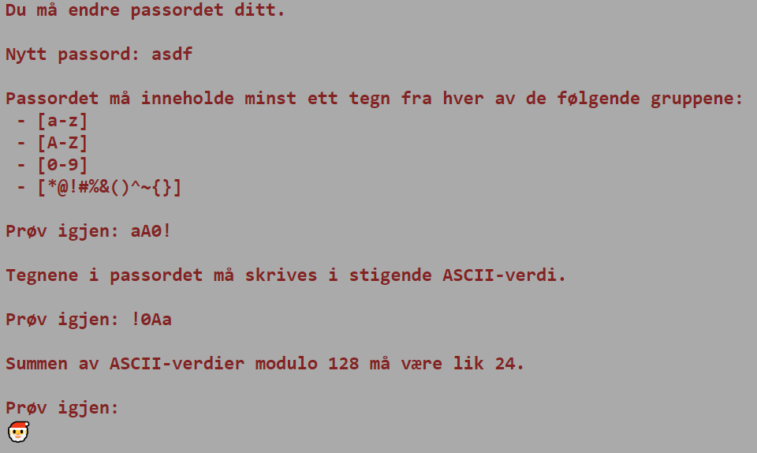

# Velg passord

## Oppgaven

    Gratulerer!

    Nå er det på tide å bytte passord på brukeren din. Gjeldende passord policy er kjent for å være litt kranglete, så lykke til!

---

## Løsningen

### Steg 1

Prøv et random passord!  
Etter noen forsøk får vi basically vite formatet på passordet.  
Passord man kan velge har også en spesiell regel.  
(NB! Hvis man er uheldig her får man ikke oppgitt alle reglene for passordformatet!)



### Steg 2

Siden vi nå vet formatet på passordet kan vi finne et gyldig passord.

-   Progge
-   Løse manuelt med ASCII-tabell for hånd
-   Løse i Excel

### Steg 3

Løse oppgaven med programmering

```javascript
// Create arrays of allowed characters in ASCII-table-order
var signs = [..."!#%&()*"];
var number = [..."0123456789"];
var signs2 = [..."@"];
var upper = [..."ABCDEFGHIJKLMNOPQRSTVUWXYZ"];
var signs3 = [..."^"];
var lower = [..."abcdefghijklmnopqrstuvwxyz"];
var signs4 = [..."{}~"];

// Make the valid combos ready
var combo = [signs, number, upper, lower];
var combo2 = [number, signs2, upper, lower];
var combo3 = [number, upper, signs3, lower];
var combo4 = [number, upper, lower, signs4];

// Make an array of all valid combos of combos
var comboOfCombos = [combo, combo2, combo3, combo4];

// Recursive function to generate (almost) valid passwords
const generatePasswords = (arrays, arrayIndex) => {
    if (arrayIndex === arrays.length - 1) return arrays[arrayIndex].map(c => "" + c);

    let passwords = [];

    for (var i = 0; i < arrays[arrayIndex].length; i++) {
        var password = "" + arrays[arrayIndex][i];
        var newPasswords = generatePasswords(arrays, arrayIndex + 1);

        if (newPasswords && newPasswords.length > 0) {
            passwords = [...passwords, ...newPasswords.map(newPassword => password + newPassword)];
        } else {
            passwords.push(password);
        }
    }

    return passwords;
};

// Iterate over all valid combos and generate (almost) valid passwords
for (var combo of comboOfCombos) {
    var generatedPasswords = generatePasswords(combo, 0);

    // Iterate over all generated passwords
    for (var password of generatedPasswords) {
        // Check if the sum of characters % 128 is equal to 24
        var sum = [...password].reduce((total, current) => total + current.charCodeAt(0), 0);
        if (sum % 128 === 24) {
            // We only need one password, so just print it and return
            console.log("Valid password: " + password);
            return;
        }
    }
}
```

Output:

```text
Valid password: !0Mz
```

### Steg 4

Sjekk om passordet funker


```json
Flagg: PST{6a0f0731d84afa4082031e3a72354991}
```
