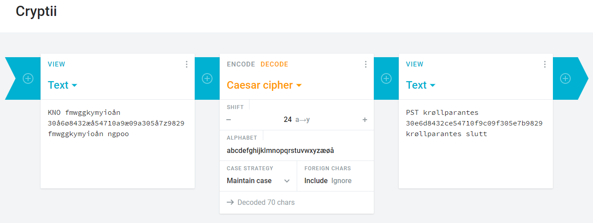

# PPK

## Oppgaven

    Se dagsbriefen: https://kalender.npst.no/03

<p><strong>Elektronisk krypteringsmaskin</strong></p><p>NPST har avdekket at den norske overvåkingstjenesten overtok en rekke ENIGMA maskiner etter den tyske okkupasjonsmakten. ENIGMA ble i stort omfang benyttet av de fleste tyske militære styrker til både kryptering og dekryptering av informasjon under andre verdenskrig. Den var enkel å bruke, og antatt å være umulig å knekke. Dette var hovedårsaken til dens utbredelse. ENIGMA ble benyttet av den norske overvåkingstjenesten som en reserveløsning frem til 1960.</p><p>Som ledd i skjermingen av ønskelister har NPST vurdert å ta i bruk ENIGMA som erstatning for dagens krypteringsprosedyre. Grunnet manglende EDB-entusiasme i grasrota møter dette stor motstand, da medbragt EDB-utstyr ute i felt er svært lite populært. Det har blitt ytret ønske om å beholde dagens penn-og-papir-kryptering (PPK), men det er uvisst hvor sikkert dette er. Kunne noen forsøkt å knekke følgende PPK-kode:</p><pre><code>KNO fmwggkymyioån 30å6ø8432æå54710a9æ09a305å7z9829 fmwggkymyioån ngpoo</code></pre><p>Skriv gjerne svaret i <a href="https://intranett.npst.no/challenges">intranettet</a>.</p>

---

## Løsningen

I denne oppgaven får vi oppgitt dette cipheret:  

`KNO fmwggkymyioån 30å6ø8432æå54710a9æ09a305å7z9829 fmwggkymyioån ngpoo`  

Løsningen er å decode dette med Ceasar cipher, rot 24.  
Viktig her er at vi dekoder det med norsk alfabet, siden cipher-teksten inneholder norske tegn.

[cryptii.com](https://cryptii.com) kan brukes for å løse denne oppgaven enkelt.



Output

```text
PST krøllparantes 30e6d8432ce54710f9c09f305e7b9829 krøllparantes slutt
```

```
Flagg: PST{30e6d8432ce54710f9c09f305e7b9829}
```
