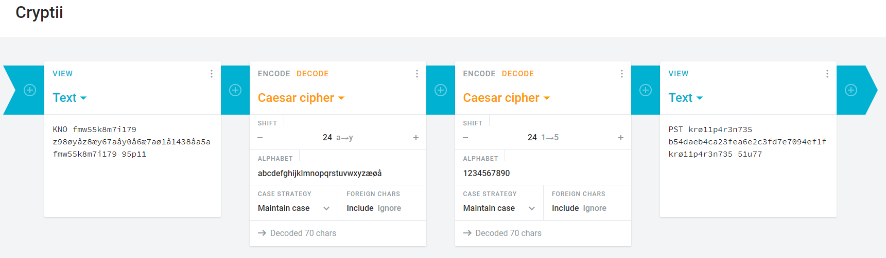

# PPKv2

## Oppgaven

    Se dagsbriefen: https://kalender.npst.no/06

<p><strong>Ny pr053dyr3 f0r kryp73ring</strong></p><p>NI553N h4r få77 på p1455 ny PPK. K4n ni553n3 hj31p3r3 v3rifi53r3 4t k0d3n 3r ukn3kk31ig?</p><pre><code>KNO fmw55k8m7i179 z98øyåz8æy67aåy0å6æ7aø1å1438åa5a fmw55k8m7i179 95p11</code></pre>

---

## Løsningen

Cipher-teksten i oppgaven ligner veldig på cipher-teksten i en tidligere oppgave. Her er det derimot også med tall i oppgaven...  
Vi biter oss merke i formatet på meldingen.  

### Steg 1

Vi prøver Rot-24 igjen med [cryptii.com](https://cryptii.com)


Her ser vi at teksten er dekodet riktig, men det er noe feil med tallene.  
Hvis vi legger litt fantasi i å lese, klarer vi å se at det skal stå **krøllparentes** istedenfor **krø55p8r7n179**, for eksempel.

Her kan det se ut som om vi bare trenger å bytte ut tall med bokstaver, slik at vi får `PST krøllparentes b98daeb8ca67fea0e6c7fd1e1438ef5f krøllparentes slutt`.  

Prøver man dette flagget vil man få feil.

### Steg 2

Oppgaven hinter til 1337-speak, så vi må prøve å få flagget til å representeres i 1337-speak!

Caesar cipher fungerer også på tall!  
Vi kan derfor prøve å rotere tallene også, for å få teksten til å bli totalt hackerman.



Dette ser mer riktig ut!

```text
PST krø11p4r3n735 b54daeb4ca23fea6e2c3fd7e7094ef1f krø11p4r3n735 51u77
```

```text
Flagg: PST{b54daeb4ca23fea6e2c3fd7e7094ef1f}
```

## Self Easter Egg

Denne oppgaven var ikke mulig å løse i andre språk enn javascript pga måten javascript håndterer `"0" === false` på (ellerno). Det vil si at dersom man ikke programmatisk løste denne i javascript, så fikk man feil svar, på grunn av en overseelse da oppgaven ble laget. Vi brukte derfor nesten en hel dag på å ikke skjønne hvorfor vi ikke hadde riktig svar. Etter vi kontaktet NISSEN i NPST fikk de rettet opp i feilen oppgaven og vi fikk skrevet inn riktig svar fra mobil midt i et julebord.

