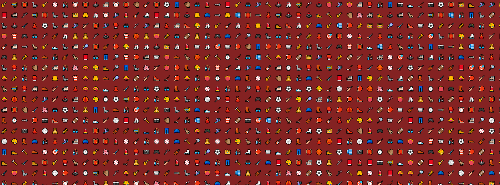
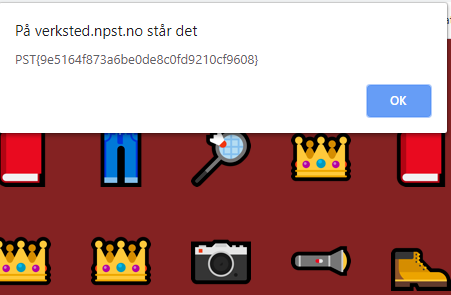
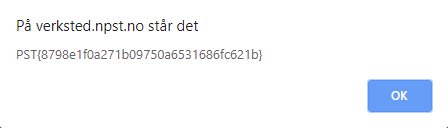

# Nissens Verksted

## Oppgaven

    Se dagsbriefen: https://kalender.npst.no/07

<p><strong>Ukens ansatt</strong></p><p>Jule NISSEN gratulerer <strong>unblvr</strong> som ukens ansatt, og takker for ekstraordinær innsats. NISSENS sekretariat har tatt kontrakt via elektronisk post.</p><p><strong>Korrigering av gårsdagens dagsbrief</strong></p><p>NISSEN vil også takke en dyktig alvebetjent som har gjort NPST oppmerksom på en feil i den krypterte teksten gårsdagens dagsbrief. Denne er nå korrigert.</p><p><strong>Begrensinger i intranettet</strong></p><p>Som noen kanskje har fått med seg har vi innskrenket antall svar som kan skrives i intranettet. Etter noen ivrige alvebetjenter hadde lagt inn så mange svar at NISSEN ikke orket å lese alle svarene, så han seg nødt til å sette en begrensning på 1000 svar.</p><p><strong>Digitalisering</strong></p><p>Som del av <em>nordpolar digitaliseringsstrategi</em> har NPST i det siste jobbet med å digitalisere NISSENS verksted. Der foregår alt av design og snekring for å lage gaver til snille barn, men vi har misstanke om at vi har mistet et flagg der inne. Kunne noen alvebetjenter tatt en titt og sett om de finner det?</p><p><a href=\"https://verksted.npst.no\">https://verksted.npst.no</a></p><p><strong>Julevurdering</strong></p><p>Det er nå <em>SANNSYNLIG</em> at det blir en GOD JUL.</p>

---

## Løsningen



Her skal man finne flagget, gjemt inne i NISSENs verksted. Hvis man klikker på bildene får man en opp en alert-box med `PST{<filnavnet-til-bildet>}`.



Vi må finne riktig bilde, for det er litt kjedelig å prøve 12 202 forskjellige koder.  
Sannsynligvis må vi finne det samme Unicode-flagget som har vært med i tidligere oppgaver.

### Steg 1

Enten begynner man å lete manuelt, eller så må vi finne ut en smart måte å eliminere mulige bilder på. Denne oppgaven går det kanskje raskere å løse manuelt ved å lete rundt, ved mindre man er en ninja til å kode.

To måter å eliminere ting på:

-   Finne en måte å sjekke for duplikater med Javascript direkte i browseren
-   Laste ned alle bildene og eliminere duplikater lokalt

#### Browser

```javascript
var findImages = () => {
    // Find all the images
    const images = document.getElementsByTagName("img");
    const numberOfImages = images.length;

    const lookup = {};
    let counter = 0;

    // Create a canvas that we can use to draw and get pixel data
    const body = document.getElementsByTagName("body")[0];
    const canvas = document.createElement("canvas");
    canvas.width = 60;
    canvas.height = 60;

    body.insertBefore(canvas, document.getElementsByTagName("img")[0]);

    const context = canvas.getContext("2d");

    // Iterate over all of the pictures
    for (var image of images) {
        context.clearRect(0, 0, canvas.width, canvas.height);
        canvas.width = image.width;
        canvas.height = image.height;
        try {
            context.drawImage(image, 0, 0, image.width, image.height);
        } catch (exception) {
            continue;
        }

        let sum = 0;

        // Get pixel data and create a sort of checksum for each picture by summing the Red value for each pixel
        // To make this a bit more efficient, we just focus on a small 10x10 square of the picture
        // 10x10 * 12 202 === 1 220 200 pixels to check, 60x60 * 12 202 === 43 927 200 pixels to check
        for (var x = 30; x < 40; x++) {
            for (var y = 30; y < 40; y++) {
                const pixelData = context.getImageData(x, y, 1, 1).data;
                sum += pixelData[0];
            }
        }

        // Store the checksum in a lookup table, so we can keep track of how many equal checksums there are
        if (lookup[sum] === undefined) {
            lookup[sum] = [];
        }

        console.log((++counter / numberOfImages).toFixed(2) * 100 + "%");
        lookup[sum].push(image);
    }

    // Iterate over all lists that have more than 3 equal checksums,
    // and remove the images from the DOM, leaving only the unique ones
    for (var list of Object.values(lookup).filter(list => list.length > 3)) {
        for (var image of list) {
            image.remove();
        }
    }
};
```

På [NISSENs verksted](https://verksted.npst.no) må vi først sørge for at alle bildene er lastet inn i DOM-en. Alle bildene lazy-loades etter som man scroller nedover på siden, så en kjapp måte å laste inn alle på er å zoome helt ut med `[ctrl]+[minus]` og begynne å scrolle.

Når alle bildene er lastet inn åpner vi consolen, copy paster koden, og kjører den med `loadImages()`

Etter koden er ferdig kjørt, sitter vi igjen med disse tre symbolene. En av disse er et flagg!


Trykker vi på flag-ikonet får vi servert flagget vi trenger for å løse oppgaven



```json
Flagg: PST{8798e1f0a271b09750a6531686fc621b}
```
