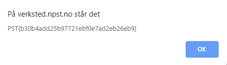

# Bedriftsspionasje

## Oppgaven

    Våre analytikere mistenker at det også kan foregå spionasje mot Nissens verksted. Kan du ta en ny titt og se om du finner noe muffens?

---

## Løsningen

Det er en spion i NISSENs verksted!  
Hvem kan være interessert i å spionere mot _Nordpolar_ Sikkerhetstjeneste?
_Sørpolar Sikkerhetstjeneste_!  
Og hvem er det som er temmelig mistenkelig og bor på Sørpolen?

**Pingviner** selvfølgelig.

Heldigvis for oss fant vi en pingvin i forrige oppgaves løsning.


Klikker vi på pingvinen får vi flagget vi trenger for å løse oppgaven.



```json
Flagg: PST{b30b4add25b97721ebf0e7ad2eb26eb9}
```
