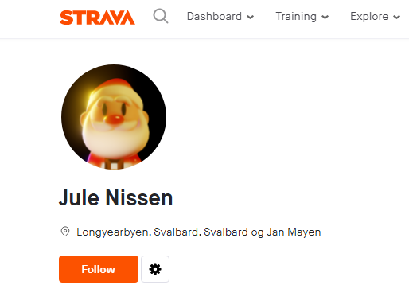
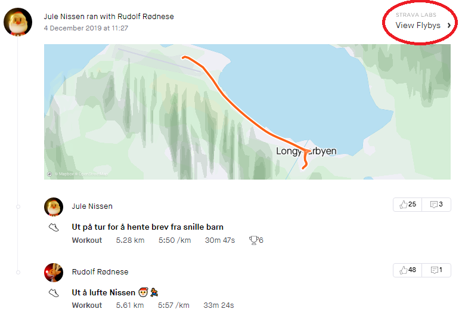
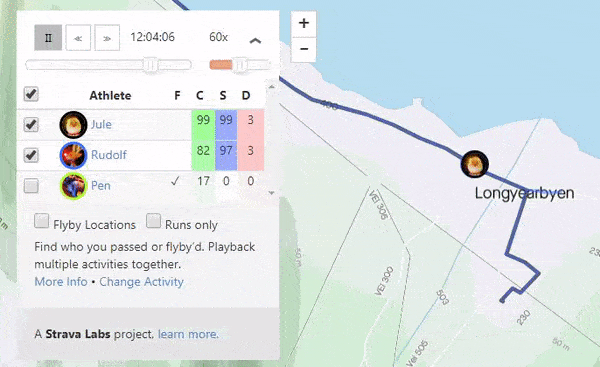
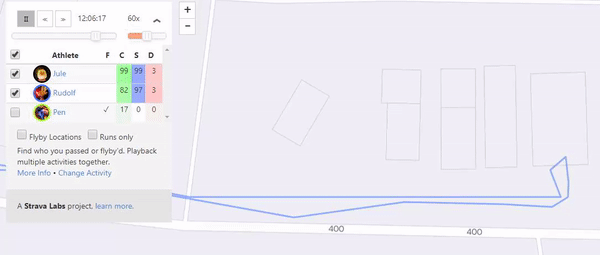
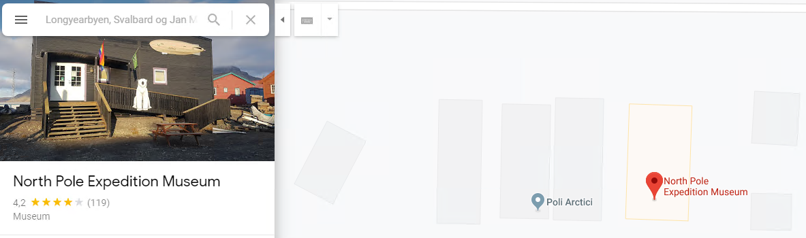

# 8. desember

## Oppgaven

    Se dagsbriefen: https://kalender.npst.no/08

<p></p><p><strong>Lokalisering av isbjørn</strong></p><p>Den 4. desember dro Jule NISSEN og Rudolf RØDNESE på joggetur til postkontoret for å hente juleønsker fra snille barn. Etter en noe turbulent sledetur iførte de seg NPSTs nye treningsklær og jogget fra sledeplassen til postkontoret. På turen tok Rudolf RØDNESE en liten omvei, hvor han observerte en mistenkelig isbjørn. Uheldigvis greier ikke Rudolf RØDNISSE å huske hvor han befant seg da han observerte isbjørnen.</p><p>Kan en alvebetjent se nærmere på dette, og rapportere tilbake lokasjonen til isbjørnen i intranettet?</p><p>Rudolf RØDNESE vil helst ha lokasjonen til isbjørnen (så nøyaktig som mulig) i uppercase, inklusive mellomrom, omgitt av <code>PST{</code> og <code>}</code>.</p><p>Eksempel: <code>Julenissens verksted</code> → <code>PST{JULENISSENS VERKSTED}</code>.</p>

---

## Løsningen

Bildet hinter sterkt til Strava, en tjeneste for folk som liker å trene. Her får man oversikt over turene man har gått. Kanskje kan vi finne ut hvor Jule NISSEN og Rudolf RØDNESE har gått her?

Vi lager en bruker på Strava og begynner å lete.
Etter hvert finner vi en konto som heter "Jule NISSEN".



Scroller vi ned på profilen til Jule NISSEN finner vi en loggført tur.
Her kan vi klikke på "View Flybys" for å se en mer detaljert visning av turen, samt eventuelle andre som har vært på samme tur samtidig.



Når vi får åpnet Flybys for turen ser vi at også Rudolf RØDNESE har vært med på turen. Siden oppgaven spør om hvor Rudolf har vært, huker vi av for å se Rudolf sin loggføring også.



Vi tar en nærmere titt på hvor Rudolf RØDNESE har vært!

;

Strava viser ikke navn på bygninger og mindre steder på kartet, så her må vi ta i bruk Google Maps eller andre kart-tjenester.



Rudolf vil ha lokasjonen til Isbjørnen, og vi er tilbøyelige til å tro at det finnes "merkelige isbjørner" på North Pole Expedition Museum! Da har vi også funnet flagget 😊

```json
Flagg: PST{NORTH POLE EXPEDITION MUSEUM}
```
