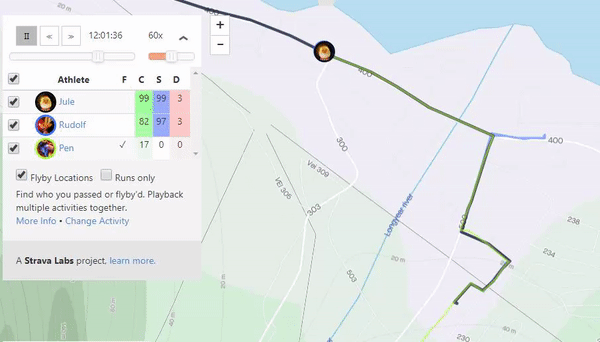
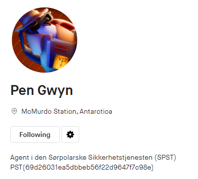

# Spionaktivitet

## Oppgaven

    Det har kommet tips om mulig spionaktivitet utført av sørpolare agenter på Svalbard i tidsrommet Nissen og Rudolf var på løpetur.

    Kan du identifisere en agent?

---

## Løsningen

Hvis vi fulgte nøye med i forrige oppgave kunne vi se en annen person som var på tur i samme område og samme tidsrom som Jule NISSEN og Rudolf RØDNESE. Huker vi av for denne personen i Flyby mode også, ser vi raskt at noen følger etter Jule NISSEN! _Temmelig Mistenkelig!_.



Vi tar en nærmere titt på denne personen, "Pen".



Det viser seg at dette sannsynligvis er den samme fremmede agenten som har vært og snoket i Jule NISSENs verksted. Agenten går under navnet "Pen Gwyn", er agent i den Sørpolarske Sikkerhetstjenesten (SPST), og holder til på McMurdo Station i Antarktis.

Flagget ligger som klartekst i profilen til Pen Gwyn.

```json
Flagg: PST{69d26031ea5dbbeb56f22d9647f7c98e}
```
