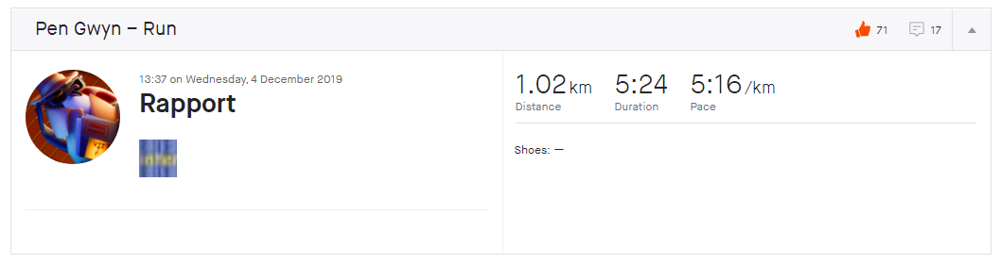

# Mystiske profiler

## Oppgaven

    Våre analytikere mistenker at Pen Gwyn har rapportert hjem til sine kontakter på sydpolen.

    Klarer du å dekode noe av kommunikasjonen?

---

## Løsningen

Vi leter litt rundt på profilsiden til Pen Gwyn og finner en loggført tur kalt "Rapport".



I denne rapporten er det lastet opp et vedlegg i form av et bilde.


Ved første øyekast kan dette se ut som en barcode, men det viser seg å være noe helt annet.

Zoomer vi inn ser vi tykke og korte linjer. Disse viser seg å være morse-kode.

`.--. ... - -.- .-. --- .-.. .-.. .--. .- .-. . -. - . ... . ----- -.... .... ...-- .---- -.. .---- ----. ..-. ..-. ----- ..--- ----- .- ....- --... ----. .... ..--- ----- . ..-. ..--- ---.. -.-. ---.. -.. .---- . ..--- -.-. -.- .-. --- .-.. .-.. .--. .- .-. . -. - . ... ... .-.. ..- - -`

Vi dytter disse inn i en [morse2ascii-oversetter](http://www.unit-conversion.info/texttools/morse-code/), og får output:

`pstkrollparentese06h31d19ff020a479h20ef28c8d1e2ckrollparentesslutt`

```json
Flagg: PST{e06h31d19ff020a479h20ef28c8d1e2c}
```

## Easter egg

Profilbildet til Pen Gwyn inneholder et bilde med en ny lapp


