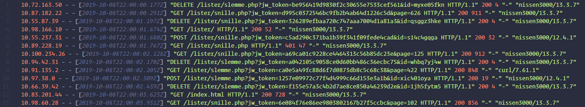

# Token effort

## Oppgaven

    Se dagsbriefen: https://kalender.npst.no/13

<p><strong>Nøkkel på avveie</strong></p><p>NPST sin driftsansvarlig er dessverre sykemeldt, og jobben hans er midlertidig overtatt av en alv ved pakkeavdelingen til NISSENS verksted. Pakkealven har lagt merke til noe muffens som foregår på Jule NISSENS liste over snille og slemme barn. Pakkealven, som ikke er veldig teknisk anlagt, har behov for hjelp til å finne ut av hvem som snoker i sakene. Han har ikke så mange spor å gi, men han har pakket ned bevismaterialet godt for å unngå bevisforspillelse.</p><p>Alvebetjenten som overbrakte informasjonspakken til Jule NISSEN har dessverre glemt passordet som ble benyttet. Hans små grå begynner dessverre å gå ut på dato, men han mente at passordet var nevnt som en av teknologiene i <a href="https://www.finn.no/165416216">annonsen</a> fra vår samarbeidende tjeneste, PST.</p><p>FILER:</p><ol><li><a href="./assets/logger.7z.001">./assets/logger.7z.001</a></li><li><a href="./assets/logger.7z.002">./assets/logger.7z.002</a></li><li><a href="./assets/logger.7z.003">./assets/logger.7z.003</a></li><li><a href=".assets/logger.7z.004">./assets/logger.7z.004</a></li></ol><p>Kan en alvebetjent finne ut av hvilken API-nøkkel som er kompromittert, og legge det inn i intranettet på formen <code>PST{&#x3C;den-kompromitterte-nøkkelen>}</code>?</p><p><strong>Unngå lekkasje</strong></p><p>NISSEN vil også oppfordre alle ansatte til å beskytte informasjon bedre ved bruk av kryptering. Sørg også for å bruke gode passord.</p>

---

## Løsningen

I denne oppgaven skulle man helt sikkert brukt et litt mer avansert loggverktøy, men vi løste det med VSCode og litt Regex.

Det første vi må gjøre er å finne passordet til arkiv-filene, og oppgaveteksten sier oss at passordet er en av teknologiene nevnt i Finn-annonsen til PST. Etter å ha prøvd litt forskjellig finner vi passordet: `Graylog`

Formatet på zippen er rimelig annoying, for her har vi zip-filer nøstet i zip-filer nøstet i zip-filer og det vil ingen ende ta. Her finnes det
sikkert en fancy command som kan unzippe rekursivt innover i zip-filen, men vi åpnet den bare i 7zip og nøstet oss gjennom ganske kjapt manuelt og hentet ut de filene som finnes. Vi satt da igjen med disse filene

- `2019-12-07.access.log`
- `2019-12-08.access.log`
- `2019-12-09.access.log`
- `2019-12-10.access.log`

Kombinert har disse loggfilene `184 579` + `247 215` + `352 159` + `247 125` === `1 031 078` linjer logg, og i denne myriaden skal vi altså finne en API-nøkkel som er kompromitert!



### Steg 1

Vi prøver først å finne ut hvordan en API-nøkkel, eller en Token, ser ut. Dette finner vi raskt, da det er veldig mange kall til nettsiden som inneholder `jw_token=<guid>`, for eksempel `jw_token=66eba1aea8fe6bb5c3d9c85034884c2c`

### Steg 2

Vi fjerner først all linjer som ikke bruker en `jw_token` med Regexen `^((?!jw_token).)*$`, da disse kallene ikke er så interessante.

Vi antar at den fremmede agenten har forsøkt å få tilgang til nettsiden uten suksess før den eventuelt har fått det til. Det er derfor ikke så interessant på dette stadiet å se alle kallene som har returnert `200 OK` fra serveren. Vi fjerner disse med en regex `^.*?200.*?$`. Vi fjerner også alle kall som ikke har brukt en `jw_token` med regexen `^((?!jw_token).)*$`, da disse ikke gir oss så mye mer informasjon.

Nå er filene stort sett tomme, og inneholder mye blankspace, så vi fjerner disse også med Regexen `^\s+$\n`.

### Steg 3

Filen `2019-12-09.access.log` inneholder nå bare to linjer!
Her kan vi se at noen har vært så frekke at de har prøvd å slette selveste Jule NISSEN fra listen over snille barn!

```log
10.87.113.12 - - [2019-12-09T11:51:19.031Z] "DELETE /lister/snille.php?id=jule_nissen&jw_token=67e49727affdee991ec58180ee657b28 HTTP/1.1" 403 24 "-" "curl/7.61.1"
```

Men det mest interessante er at vi også finner en veldig spesifikk kommando. Noen har nemlig også prøvd å slette "Gwyn" fra listen over slemme barn! Sannsynligvis er det Pen Gwyn fra SPST som prøver å lage ugagn her nå igjen...

```log
10.87.113.12 - - [2019-12-09T11:42:13.574Z] "DELETE /lister/slemme.php?id=gwyn&jw_token=f6d1ab9cebe6c5d734989151ec073bfe HTTP/1.1" 401 275 "-" "curl/7.61.1"
```

### Steg 4

Nå har vi funnet ut hva den ubudne gjesten prøver å gjøre. Vi kan derfor fokusere på `200 OK` requests igjen, der vi tar denne informasjonen med i spill.

Vi beveger oss over til filen `2019-12-09.access.log` og prøver å finne en request som enten har slettet Jule NISSEN fra listen over snille barn, som har slettet "Gwyn" fra listen over slemme barn, eller prøvd å legge til "Gwyn" i listen over snille barn.

Vi reverterer endringene som er gjort i filen, og rensker den opp på nytt med Regexen `^((?!gwyn).)*?$`, og fjerner alle tomme linjer med `^\s+$\n`

Nå sitter vi igjen med 5 linjer logg, der vi kan se at "Gwyn" har blitt prøvd slettet fra listen over slemme barn uten suksess to ganger, før vi finner innslag der "Gwyn" med suksess er slettet fra listen over snille barn, og en `POST` hvor "Gwyn" er lagt inn i listen over snille barn!

```log
10.87.113.12 - - [2019-12-09T11:42:42.824Z] "DELETE /lister/slemme.php?id=gwyn&jw_token=67e49727affdee991ec58180ee657b28 HTTP/1.1" 200 275 "-" "curl/7.61.1"
10.87.113.12 - - [2019-12-09T11:43:51.008Z] "POST /lister/snille.php?id=gwyn&jw_token=67e49727affdee991ec58180ee657b28 HTTP/1.1" 200 275 "-" "curl/7.61.1"
```

Vi har nå funnet den kompromiterte API-nøkkelen, `67e49727affdee991ec58180ee657b28`

```javascript
Flagg: PST{67e49727affdee991ec58180ee657b28}
```
