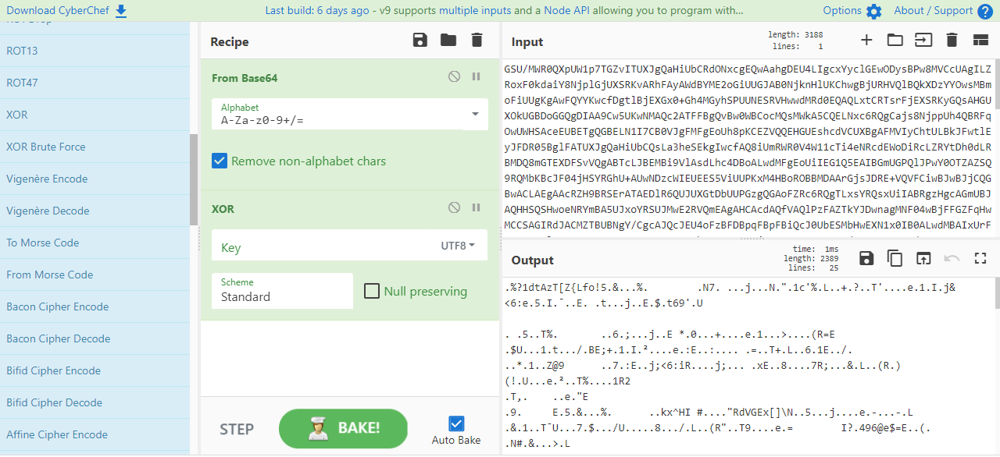
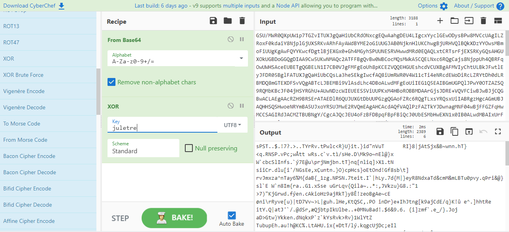
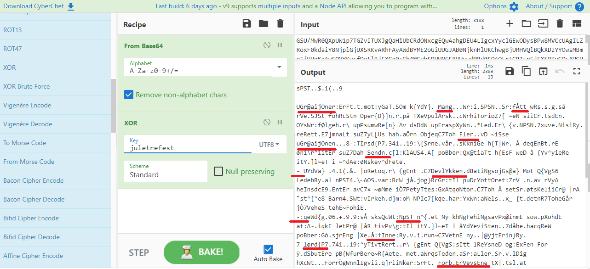
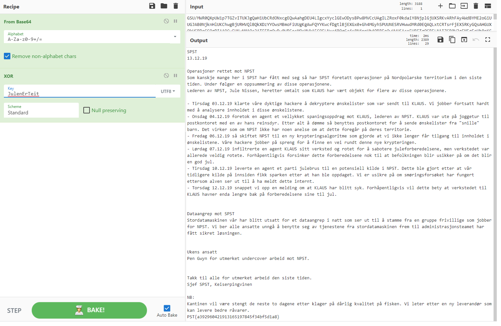

# Lekket data

## Oppgaven

    Se dagsbriefen: https://kalender.npst.no/14

<p><strong>Ukens ansatt</strong></p><p>Jule NISSEN gratulerer joey som ukens ansatt, og takker for at han har skapt et fantastisk arbeidsmiljø tross den korte tiden han har jobbet med oss. NISSENS sekretariat vil ta kontakt via elektronisk post førstkommende virkedag. NISSEN håper gårsdagens prøvelser gikk bra.</p><p><strong>Lekkasje fra SPST</strong></p><p>NPST har gjennom en temmelig hemmelig kilde fått tilsendt et dokument som stammer fra SPST sitt interne nettverk. Kilden sier at filen kommer fra en harddisk som ikke ble makulert da datamaskinen ble kastet. Harddisken var markert med U+2295/U+22BB. Utover dette har vi ingen andre spor om krypteringen som er brukt. Kan en alvebetjent se om det finnes noen mulighet for å hente ut dataen her?</p><p>Det krypterte dokumentet følger etter en <em>viktig</em> beskjed om julebordet!</p><p><strong>Julebord</strong></p><p>Det nærmer seg julebord for våre alvebetjenter! Det blir konkurranse i hammerkasting og lengste hammerdistanse vil vinne en premie! Juleskinke vil også bli servert etter en forrett av julegrøt. Mandel er så klart inkludert!</p><p><strong>Melding</strong><br/><code>GSU/MWR0QXpUW1p7TGZvITUXJgQaHiUbCRdONxcgEQwAahgDEU4LIgcxYyclGEwODysBPw8MVCcUAgILZRoxF0kdaiY8NjplGjUXSRKvARhFAyAWdBYME2oGiUUGJAB0NjknHlUKChwgBjURHVQlBQkXDzYYOwsMBmoFiUUgKgAwFQYYKwcfDgtlBjEXGx0+Gh4MGyhSPUUNESRVHwwdMRd0EQAQLxtCRTsrFjEXSRKyGQsAHGUXOkUGBDoGGQgDIAA9Cw5UKwNMAQc2ATFFBgQvBw0WBCocMQsMWkA5CQELNxc6RQgCajs8NjppUh4QBRFqOwUWHSAceEUBETgQGBELN1I7CB0VJgFMFgEoUh8pKCEZVQQEHGUEshcdVCUXBgAFMVIyChtULBkJFwtlEyJFDR05BglFATUXJgQaHiUbCQsLa3heSEkgIwcfAQ8iUmRWR0V4W11cTi4eNRcdEWoDiRcLZRYtDh0dLRBMDQ8mGTEXDFSvVQgABTcLJBEMBi9VlAsdLhc4DBoALwdMFgEoUiIEG1Q5EAIBGmUGPQlJPwY0OTZAZSQ9RQMbKBcJF04jHSYRGhU+AUwNDzcWIEUEES5ViUUPKxM4HBoROBBMDAArGjsJDRE+VQVFCiwBJwBJjCQGBwACLAEgAAcRZH9BRSErATAEDlR6QUJUXGtDbUUPGzgQGAoFZRc6RQgTLxsYRQsxUiIABRgzHgcAGmUBJAQHHSQSHwoeNRYmBA5UJxoYRSUJMwE2RVQmEAgAHCAcdAQfVAQlPzFAZTkYJDwnagMNF04wBjFFGZFqHwMCCSAGIRdJACMZTBUBNgY/CgcAJQcJEU4oFzBFDBpqFBpFBiQcJ0UbESMbHwEXN1x0IB0ALwdMBAIxUrFFDYwnGAlFHaBSNgAHDT4BCRZONR0nEQIbJAEDFwsxUjIKG1SvVR8AACEXdJ0HByEQAAwdMRcmRQ8GK1VOFgAsHjgAS1QoFB4LQGU2MRFJAiMHBwAcZQE7CEkbJ1UiNT0RUj0OAhFqHQ0XTisdMQtJFSQQABYLZR05RQgAahEJERogUjIKGxEtkB5FHqBSMAAbETlVGAAcNxsgChsdL1tmSE4DADEBCBNqRVpLX3dcZVxJB69VHw4HIwYxEUk6GiY4RRosHnQAB1QkDEwOHDwCIAAbHSQSHwQCIh0mDB0ZL1UfCgNlFT4KGxAvVQ0RTjMbdAwCHy9VAAAAIhcmRQ+ROFUYDAIiEzoCSQAjGUwMACsaOwkNET5VBUWWKwE/AAUdOQEJCwtrUgKAGxFqHQ0GBSAAMUUDGygXCRdONZd0FhkGLxsLRQgqAHSASRIjGwIATiAcdBMMHWoHGQsKMVIwAAcaL1UCHAtlGSYcGQAvBwULCSAcem9EVAaNHgEPIlJkUkdFeFtdXE4sHDIMBQA4EB4RC2UXOkUIEy8bGEUlCTMBNkkHIwEYRRggAD8WHREuVQMCTjcdIAAdVCwaHkWLZQE1BwYALwcJRQQwHjEDBgYoEB4ACiAeJwAHEWZVAQAAZQQxFwIHPhAIABplBDUXSRUmGQkXCyEXdBMMGC4cC0UcKgYxEQxaajMDFwagAjELHRgjEhoMHWUUOxcaHSQeCRdOIRcgEQxULBoeBws3FzAABQcvGwlFACoZdBEAGGoUGEUMIBQ7CQIaIxsLAABlEDgMG1Q/BgUOBSAAdBWMVCUYTAELMVI2CQAGahACRQkqFnQPHBhkf0FFOiwAJwEIE2pEXEtfd1xlXEkYLwMJFxogUjELSRUtEAIRTiAGdBUIBj4cTA8bKRc2FxwHagEFCU4gHHQVBgAvGx8MCykedA4AGC4QTAxOCyIHMUdUDhAYEQtlEDgASRMgGh4RTiAGIAAbVCsBTBOLN1IgDA0YIxIJFwtlGT0JDRFqBYlFByscJwwNESRVCgwFLlInFQgGIRACRQsxBjEXSRU+VQQEAGUQOABJGzoFCAQJIAZ6RT8dahAeRRs2Gz8XDFQ6kEwKA2UBOZ0bHSQSHwMBNwGsDgwAah0NF04jBzoCDAY+VQkRGiAAJwoEVCsZGgAAZQExF0kBPlUYDAJll3QNCFQnEAABGmUWMREdEWocAhELNxwgS2NZaiEDFx0hEzNFWEZkRF5LX3xSJwsIBDoQGEUYLFI7FRlULxtMCAspFj0LDlQlGEwEGmU5GCQ8J2odDRdOJx49ER1UOQwHS04DHSYNjAQvGxgJByIEPRZJAiMZTAELMQYxRQsRPgxMBBplBDEXAgc+EAgAGmUGPQlJPwY0OTZOLRMiCwwGahACAQ9lHjELDgYvVQ4EBWUCsUUPGzgXCRcLIRc4FgwaL1UfDAAgUiAMBVQgAABLZE94EAQdFSsbCxcLNVI5Ch1UGSU/MWQWBjsXDRU+FAEEHS4bOgAHVDyQHkUGJAB0BwUdPgFMEBo2EyARSRIlB0wAGmUWNREIFSQSHgAeZRt0CwgAPlUfCgNlATEXSQE+VRgMAmWXdBYdFScYCUUINxN0AAdULQcZFR4gUjIXAAIjGQAMCSBSJwoEVCAaDgcLN1IyChtUBCU/MUBlJD1FCxE4VQ0JAiBSNQsaFT4BCUUbKxwzgEmRahcJCxcxBjFFGhEtVQ0TTjEYMQsMBz4QAgBOIwA1RRoAJQcIBBokHzUWAh0kEAJFCDcXOUUdHSZVDQEDLBw9Fh0GKwYGCgA2BjEEBBE+VQQEHGUUsREdVDkcBxcLMVI4nRoaIxsLAABreF5vPB8vGx9FDysBNREdfhoQAkUpMgs6RQ8bOFUZEQMgAD8AHVQ/GwgAHCYdIgAbVCsHDgAHIVI5Ch1UBCU/MUBPeF4xCB8hVRgMAmUTOAkMVCwaHkUbMR8xFwIRPlUNFwwgGzBFDREkVR8MHTEXdBEAEC8bQm89LxcyRTokGSFARSUgGycAGwQjGwsTBysXOm9jOghPZi4PKwY9CwwaagMFCU4zlCYASQc+EAICGmUWMUUHETkBCUUaKlIwBA4RJBBMABoxFyZFAhgrEgkXTjWXdAGMBiYcC0UFMxM4DB0RPlUcgE4jGycODBpkVToMTikXIAAbVC8BGAAcZRc6RQcNahkJEws3EzoBkQZqBgMITi4TOkUFETwQHgBOJxcwFwxUOJAaBBwgAHpvOSceDg1WV3dLYlVdRntMXVZfc0dlXF5MfkAKVlonFGEBWBVyCA==</code></p>

---

## Løsningen

Vi lurer først på hvilke merkelige tegn harddisken er merket med.
Sjekker vi opp `U+2295` og `U+22BB` finner vi ut at dette representerer Unicode-tegnene `⊕` og `⊻` respektivt. Begge to er tegn for å representere `XOR`. Det kan derfor tyde på at oppgaven er sterkt knyttet til noe skal XORes.

Selve cipheret vi får oppgitt ser vi raskt at er Base64-encodet.

Vi fyrer opp [https://gchq.github.io/CyberChef/](https://gchq.github.io/CyberChef/), og drar inn de to modulene for å decode B64 og for å teste ut XOR. `CyberChef` er perfekt for denne oppgaven, da det kjapt lar oss teste ut forskjellige inputs og resultater; vi kan manuelt dekode oppgaven i "realtime" ved prøving og feiling, og til slutt suksess.



Måten XOR fungerer på her er at det genereres en repetativ key basert på det vi skriver inn i `Key`-feltet, like lang som inputen. Vi tester litt forskjellige keys, og finner snart ut at nøkkelen `juletre` gir resultat i form av at `sPST` dukker opp i starten av Output.



Dette lover bra, men resten av teksten gir ikke så mye mening enda. Vi prøver derfor litt forskjellige ord som begynner på `jule`.

Etter hvert får vi resultat med ordet `juletrefest`. Teksten får plutselig litt struktur, og det dukker opp mange halvferdige ord gjennom teksten.



Nå vet vi at vi er ganske nære, så nå er det bare å prøve å bytte ut bokstaver helt til vi har riktig key.



Her er teksten ferdig dekodet, og vi får også oppgitt dagens flagg helt nederst.
[Link til ferdig oppsatt CyberChef](https://gchq.github.io/CyberChef/#recipe=From_Base64('A-Za-z0-9%2B/%3D',true)XOR(%7B'option':'UTF8','string':'JulenErTeit'%7D,'Standard',false)&input=R1NVL01XUjBRWHBVVzFwN1RHWnZJVFVYSmdRYUhpVWJDUmRPTnhjZ0VRd0FhaGdERVU0TElnY3hZeWNsR0V3T0R5c0JQdzhNVkNjVUFnSUxaUm94RjBrZGFpWThOanBsR2pVWFNSS3ZBUmhGQXlBV2RCWU1FMm9HaVVVR0pBQjBOamtuSGxVS0Nod2dCalVSSFZRbEJRa1hEellZT3dzTUJtb0ZpVVVnS2dBd0ZRWVlLd2NmRGd0bEJqRVhHeDArR2g0TUd5aFNQVVVORVNSVkh3d2RNUmQwRVFBUUx4dENSVHNyRmpFWFNSS3lHUXNBSEdVWE9rVUdCRG9HR1FnRElBQTlDdzVVS3dOTUFRYzJBVEZGQmdRdkJ3MFdCQ29jTVFzTVdrQTVDUUVMTnhjNlJRZ0NhanM4TmpwcFVoNFFCUkZxT3dVV0hTQWNlRVVCRVRnUUdCRUxOMUk3Q0IwVkpnRk1GZ0VvVWg4cEtDRVpWUVFFSEdVRXNoY2RWQ1VYQmdBRk1WSXlDaHRVTEJrSkZ3dGxFeUpGRFIwNUJnbEZBVFVYSmdRYUhpVWJDUXNMYTNoZVNFa2dJd2NmQVE4aVVtUldSMFY0VzExY1RpNGVOUmNkRVdvRGlSY0xaUll0RGgwZExSQk1EUThtR1RFWERGU3ZWUWdBQlRjTEpCRU1CaTlWbEFzZExoYzREQm9BTHdkTUZnRW9VaUlFRzFRNUVBSUJHbVVHUFFsSlB3WTBPVFpBWlNROVJRTWJLQmNKRjA0akhTWVJHaFUrQVV3TkR6Y1dJRVVFRVM1VmlVVVBLeE00SEJvUk9CQk1EQUFyR2pzSkRSRStWUVZGQ2l3Qkp3QkpqQ1FHQndBQ0xBRWdBQWNSWkg5QlJTRXJBVEFFRGxSNlFVSlVYR3REYlVVUEd6Z1FHQW9GWlJjNlJRZ1RMeHNZUlFzeFVpSUFCUmd6SGdjQUdtVUJKQVFISFNRU0h3b2VOUlltQkE1VUp4b1lSU1VKTXdFMlJWUW1FQWdBSENBY2RBUWZWQVFsUHpGQVpUa1lKRHduYWdNTkYwNHdCakZGR1pGcUh3TUNDU0FHSVJkSkFDTVpUQlVCTmdZL0NnY0FKUWNKRVU0b0Z6QkZEQnBxRkJwRkJpUWNKMFViRVNNYkh3RVhOMXgwSUIwQUx3ZE1CQUl4VXJGRkRZd25HQWxGSGFCU05nQUhEVDRCQ1JaT05SMG5FUUliSkFFREZ3c3hVaklLRzFTdlZSOEFBQ0VYZEowSEJ5RVFBQXdkTVJjbVJROEdLMVZPRmdBc0hqZ0FTMVFvRkI0TFFHVTJNUkZKQWlNSEJ3QWNaUUU3Q0VrYkoxVWlOVDBSVWowT0FoRnFIUTBYVGlzZE1RdEpGU1FRQUJZTFpSMDVSUWdBYWhFSkVSb2dVaklLR3hFdGtCNUZIcUJTTUFBYkVUbFZHQUFjTnhzZ0Noc2RMMXRtU0U0REFERUJDQk5xUlZwTFgzZGNaVnhKQjY5Vkh3NEhJd1l4RVVrNkdpWTRSUm9zSG5RQUIxUWtERXdPSER3Q0lBQWJIU1FTSHdRQ0loMG1EQjBaTDFVZkNnTmxGVDRLR3hBdlZRMFJUak1iZEF3Q0h5OVZBQUFBSWhjbVJRK1JPRlVZREFJaUV6b0NTUUFqR1V3TUFDc2FPd2tORVQ1VkJVV1dLd0UvQUFVZE9RRUpDd3RyVWdLQUd4RnFIUTBHQlNBQU1VVURHeWdYQ1JkT05aZDBGaGtHTHhzTFJRZ3FBSFNBU1JJakd3SUFUaUFjZEJNTUhXb0hHUXNLTVZJd0FBY2FMMVVDSEF0bEdTWWNHUUF2QndVTENTQWNlbTlFVkFhTkhnRVBJbEprVWtkRmVGdGRYRTRzSERJTUJRQTRFQjRSQzJVWE9rVUlFeThiR0VVbENUTUJOa2tISXdFWVJSZ2dBRDhXSFJFdVZRTUNUamNkSUFBZFZDd2FIa1dMWlFFMUJ3WUFMd2NKUlFRd0hqRURCZ1lvRUI0QUNpQWVKd0FIRVdaVkFRQUFaUVF4RndJSFBoQUlBQnBsQkRVWFNSVW1HUWtYQ3lFWGRCTU1HQzRjQzBVY0tnWXhFUXhhYWpNREZ3YWdBakVMSFJnakVob01IV1VVT3hjYUhTUWVDUmRPSVJjZ0VReFVMQm9lQndzM0Z6QUFCUWN2R3dsRkFDb1pkQkVBR0dvVUdFVU1JQlE3Q1FJYUl4c0xBQUJsRURnTUcxUS9CZ1VPQlNBQWRCV01WQ1VZVEFFTE1WSTJDUUFHYWhBQ1JRa3FGblFQSEJoa2YwRkZPaXdBSndFSUUycEVYRXRmZDF4bFhFa1lMd01KRnhvZ1VqRUxTUlV0RUFJUlRpQUdkQlVJQmo0Y1RBOGJLUmMyRnh3SGFnRUZDVTRnSEhRVkJnQXZHeDhNQ3lrZWRBNEFHQzRRVEF4T0N5SUhNVWRVRGhBWUVRdGxFRGdBU1JNZ0doNFJUaUFHSUFBYlZDc0JUQk9MTjFJZ0RBMFlJeElKRnd0bEdUMEpEUkZxQllsRkJ5c2NKd3dORVNSVkNnd0ZMbEluRlFnR0lSQUNSUXN4QmpFWFNSVStWUVFFQUdVUU9BQkpHem9GQ0FRSklBWjZSVDhkYWhBZVJSczJHejhYREZRNmtFd0tBMlVCT1owYkhTUVNId01CTndHc0Rnd0FhaDBORjA0akJ6b0NEQVkrVlFrUkdpQUFKd29FVkNzWkdnQUFaUUV4RjBrQlBsVVlEQUpsbDNRTkNGUW5FQUFCR21VV01SRWRFV29jQWhFTE54d2dTMk5aYWlFREZ4MGhFek5GV0Vaa1JGNUxYM3hTSndzSUJEb1FHRVVZTEZJN0ZSbFVMeHRNQ0FzcEZqMExEbFFsR0V3RUdtVTVHQ1E4SjJvZERSZE9KeDQ5RVIxVU9Rd0hTMDRESFNZTmpBUXZHeGdKQnlJRVBSWkpBaU1aVEFFTE1RWXhSUXNSUGd4TUJCcGxCREVYQWdjK0VBZ0FHbVVHUFFsSlB3WTBPVFpPTFJNaUN3d0dhaEFDQVE5bEhqRUxEZ1l2VlE0RUJXVUNzVVVQR3pnWENSY0xJUmM0Rmd3YUwxVWZEQUFnVWlBTUJWUWdBQUJMWkU5NEVBUWRGU3NiQ3hjTE5WSTVDaDFVR1NVL01XUVdCanNYRFJVK0ZBRUVIUzRiT2dBSFZEeVFIa1VHSkFCMEJ3VWRQZ0ZNRUJvMkV5QVJTUklsQjB3QUdtVVdOUkVJRlNRU0hnQWVaUnQwQ3dnQVBsVWZDZ05sQVRFWFNRRStWUmdNQW1XWGRCWWRGU2NZQ1VVSU54TjBBQWRVTFFjWkZSNGdVaklYQUFJakdRQU1DU0JTSndvRVZDQWFEZ2NMTjFJeUNodFVCQ1UvTVVCbEpEMUZDeEU0VlEwSkFpQlNOUXNhRlQ0QkNVVWJLeHd6Z0VtUmFoY0pDeGN4QmpGRkdoRXRWUTBUVGpFWU1Rc01CejRRQWdCT0l3QTFSUm9BSlFjSUJCb2tIelVXQWgwa0VBSkZDRGNYT1VVZEhTWlZEUUVETEJ3OUZoMEdLd1lHQ2dBMkJqRUVCQkUrVlFRRUhHVVVzUkVkVkRrY0J4Y0xNVkk0blJvYUl4c0xBQUJyZUY1dlBCOHZHeDlGRHlzQk5SRWRmaG9RQWtVcE1nczZSUThiT0ZVWkVRTWdBRDhBSFZRL0d3Z0FIQ1lkSWdBYlZDc0hEZ0FISVZJNUNoMVVCQ1UvTVVCUGVGNHhDQjhoVlJnTUFtVVRPQWtNVkN3YUhrVWJNUjh4RndJUlBsVU5Gd3dnR3pCRkRSRWtWUjhNSFRFWGRCRUFFQzhiUW04OUx4Y3lSVG9rR1NGQVJTVWdHeWNBR3dRakd3c1RCeXNYT205ak9naFBaaTRQS3dZOUN3d2FhZ01GQ1U0emxDWUFTUWMrRUFJQ0dtVVdNVVVIRVRrQkNVVWFLbEl3QkE0UkpCQk1BQm94RnlaRkFoZ3JFZ2tYVGpXWGRBR01CaVljQzBVRk14TTREQjBSUGxVY2dFNGpHeWNPREJwa1ZUb01UaWtYSUFBYlZDOEJHQUFjWlJjNlJRY05haGtKRXdzM0V6b0JrUVpxQmdNSVRpNFRPa1VGRVR3UUhnQk9KeGN3Rnd4VU9KQWFCQndnQUhwdk9TY2VEZzFXVjNkTFlsVmRSbnRNWFZaZmMwZGxYRjVNZmtBS1Zsb25GR0VCV0JWeUNBPT0)

```javascript
Flagg: PST{a392960421913165197845f34bf5d1a8}
```
