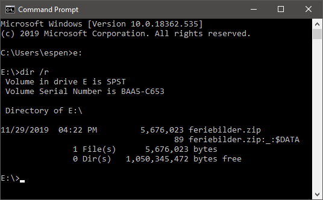
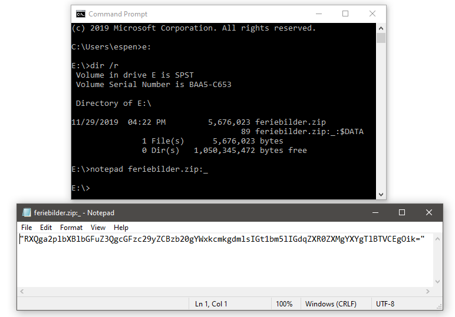
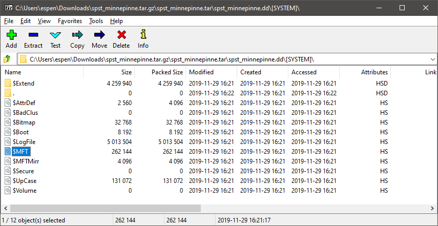
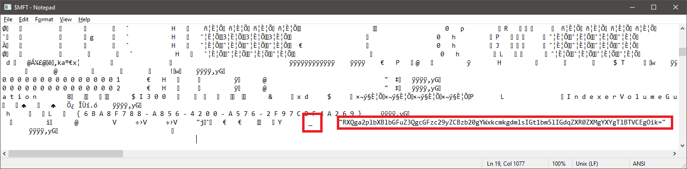

# 15. desember

## Oppgaven

    Se dagsbriefen: https://kalender.npst.no/15

<p><strong>Beslag av minnepenn</strong></p><p>NPST har i all hemmelighet tatt beslag i en minnepenn som tilhører en sydpolarsk aktør ved navn Pen Gwyn. Minnepennen ser i første øyekast ut til å være privat og inneholde feriebilder, men det er også en kryptert zip fil lagret på den. NPST trenger tilgang til denne zip filen og søker umiddelbar hjelp fra alvebetjentene for å finne passordet. Merk: Passordet ønskes innlevert i klartekst på intranettet!</p><p>Eksempel: Hunter2 -> PST{Hunter2}</p><p><a href="./assets/spst_minnepinne.tar.gz">Link til minnepenn</a></p><p><strong>Jule NISSENS sykdomsforløp</strong></p><p>Jule NISSEN ser ut til å være på bedringens vei allerede og han vil mest sannsynlig være tilbake på jobb i god tid før jul.</p><p><strong>Julevurdering</strong></p><p>Med bakgrunn i endringen av Jule NISSENS sykdom blir julevurderingen oppgradert. Det er nå <em>sannsynlig</em> at det blir en GOD JUL.</p>

---

## Løsningen

Feriebilder.zip ble forsøkt bruteforcet med både [John the Ripper](https://www.openwall.com/john/) og [hashcat](https://hashcat.net/hashcat/), men det førte ingen vei. Når vi kommer til svaret på oppgaven skjønner vi hvorfor 🤭

Oppgaven benytter seg av en teknikk for å gjemme filer i filer. Eller mer bestemt gjemme filer i [Alternate Data Streams (ADS)](https://blogs.technet.microsoft.com/askcore/2013/03/24/alternate-data-streams-in-ntfs/).

Her er det mulig å bare bruke 7zip og notepad, men vi tar den lange veien, først.

### Steg 1

Unzip fila og mount disken som en virtuell disk i Windows (Linux users gonna hate). Dette gjør vi med gratisprogrammet [PassMark OSFMount](https://www.osforensics.com/tools/mount-disk-images.html).


### Steg 2

Liste ut innholdet på disken med `dir /r`. `/r` lar oss se alternate data streams i tillegg til alle andre vanlige filer.



Nå ser vi at filen `feriebilder.zip` har en alternate data stream med navn "`_`"

### Steg 3

Vi prøver å åpne den skjulte data streamen med notepad for å se om den inneholder noe morsomt.



Den andre datastreamen inneholder noe som ser ut som base64:

`"RXQga2plbXBlbGFuZ3QgcGFzc29yZCBzb20gYWxkcmkgdmlsIGt1bm5lIGdqZXR0ZXMgYXYgTlBTVCEgOik="`

Kjører vi denne gjennom en b64-decoder får vi ut:

`Et kjempelangt passord som aldri vil kunne gjettes av NPST! :)`

Nå skjønner vi hvorfor bruteforcing av zip-filen ikke ville endt noen plass - passordet er kjempelangt!

```javascript
Flagg: PST{Et kjempelangt passord som aldri vil kunne gjettes av NPST! :)}
```

## Alternativ løsning

Åpne zip-filen `spst_minnepinne.tar.gz` med `7zip GUI` og browse inn i filene til vi kommer inn i .dd-filen.



`$MFT` (Master File Table) er en systemfil for filsystemet `NTFS`, og inneholder alle navnene på alle filer i filsystemet, og også alternate data steams. Denne kan man åpne i notepad, eller kjøre `strings` på, og vi vil kunne se b64-stringen i klartekst. Det var slik vi løste oppgaven første gang, noe som virker litt tullete nå 😝 En bedre (og penere) måte å liste ut innholdet i `MFT` er å finne et verktøy, for eksempel [https://github.com/jschicht/Mft2Csv](https://github.com/jschicht/Mft2Csv), som kan outpute den til en forståelig CSV-fil.


