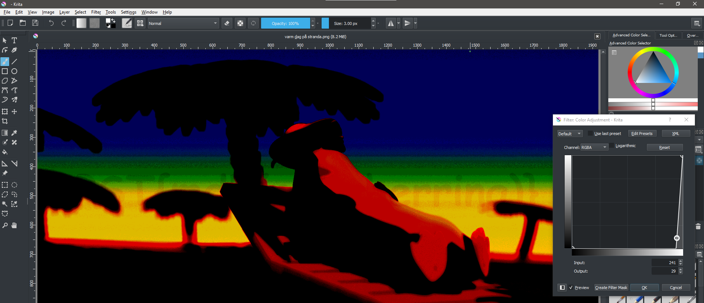
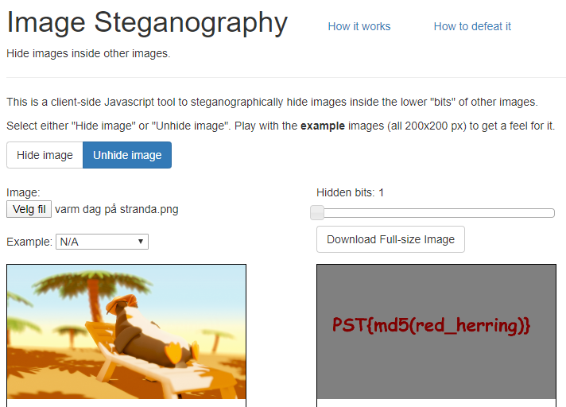

# Feriebilder

## Oppgaven

Bildene ser jo ut til å være helt normale sydpolare feriebilder, men vi vet jo at sydpolare spioner liker å gjemme data inni andre ting. Kan du hente ut et flagg fra ett av bildene?

---

## Løsningen

Vi åpner zip-filen med passordet vi fant i oppgave 1, og ser på filene:

huskelapp.png


måltid.png


varm dag på stranda.png


Vi begynte å manipulere bildene litt i [Krita](https://krita.org/en/) for å se om vi kunne finne noe i bildene. Med litt fantasi kan man finne hintet i bildet her



Siden oppgaven nevner å gjemme ting inni filer, lukter denne oppgaven [Steganografi](https://en.wikipedia.org/wiki/Steganography)

Tar vi en tur over til [https://incoherency.co.uk/image-steganography/#unhide](https://incoherency.co.uk/image-steganography/#unhide) finner vi et verktøy som fungerer for denne oppgaven.

Vi laster opp bildet `varm dag på stranda.png` som input til dekoderen, og ut kommer dette:



Her ser det ut som om vi allerede har funnet flagget! Vi trenger bare å lage en md5-hash av `red_herring`. Prøver vi dette som input til oppgaven får vi derimot feil. Dette er litt tongue-in-cheek, for "red herring" betyr bokstavelig talt "a clue or piece of information which is or is intended to be misleading or distracting".

Det viser seg derimot ikke å være så villedende som man skulle tro, tvert imot er det et hint til svaret.

I bildet `måltid.png` ser vi formodentlig Pen Gwyn 🐧 som spiser en fisk, og denne fisken er en `Red Herring` 🐠.

Svaret på oppgaven er å lage en md5-hash av hele bildefilen `måltid.png`, som gir oss `07385aacc9264738cd7c32e76f3b81a5`

```javascript
Flagg: PST{07385aacc9264738cd7c32e76f3b81a5}
```
