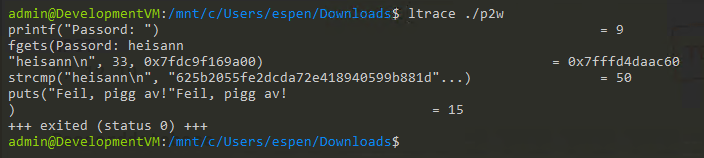
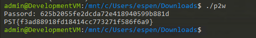
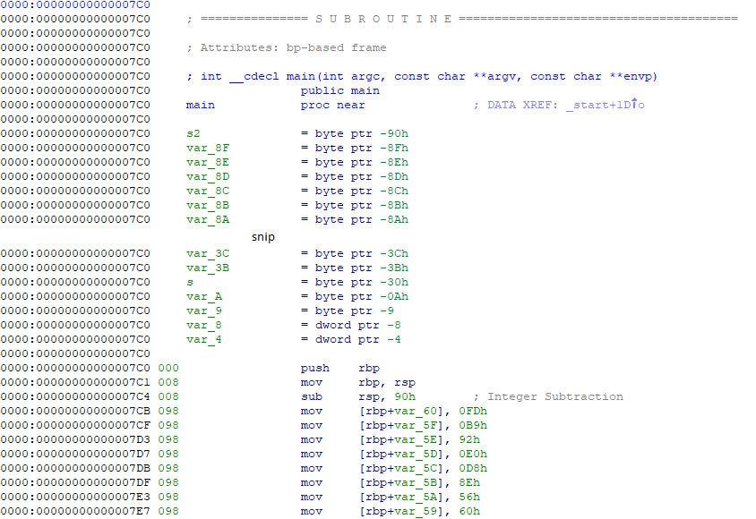
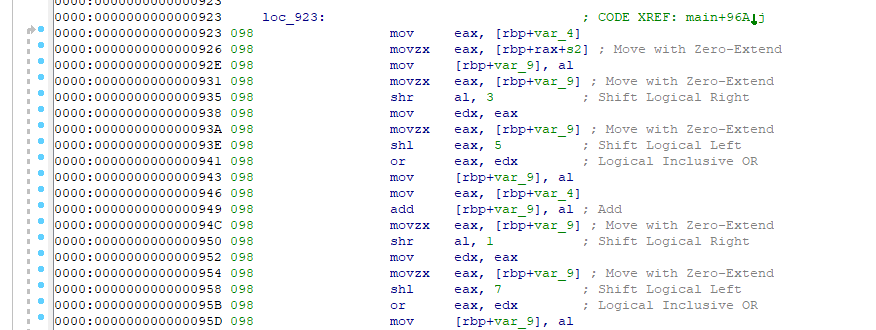
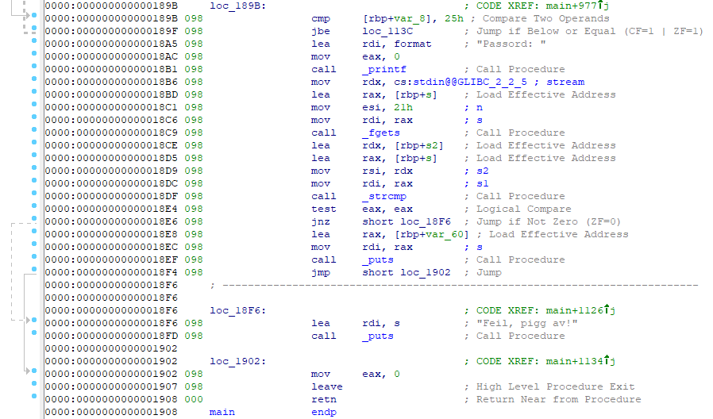
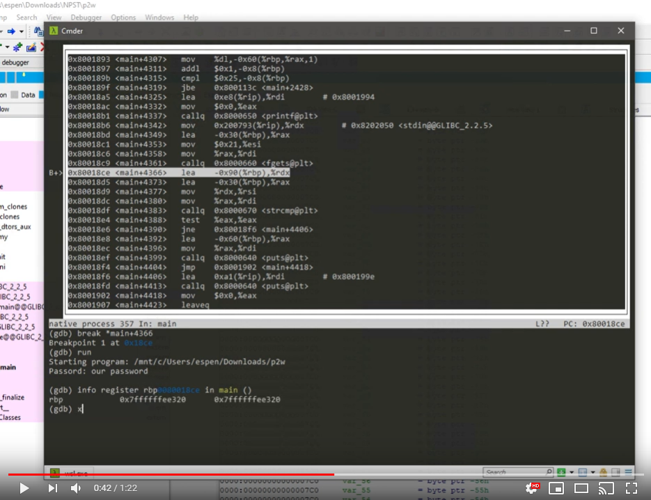

# Passorddatabase

## Oppgaven

    Se dagsbriefen: https://kalender.npst.no/17

<p><strong>Passorddatabase</strong></p><p>I tråd med Jule NISSENS anmodninger om at en bør beskytte informasjon bedre har alvene i kantinen tatt i bruk en hjemmesnekret passorddatabase. Problemet er bare at de dessverre har glemt passordet til denne. Det er kritisk at kantinealvene får tilgang til passordet som er lagret i denne databasen så fort som mulig, ellers så vil de ikke kunne åpne matlageret og lage julegrøt til i morgen! Kan en alvebetjent ta på seg oppgaven med å finne passordet til matlageret?</p><p>FIL: <a href="./assets/p2w">Link til p2w</a></p><p><strong>Oppdatering av Jule NISSENS sykdomsforløp</strong></p><p>Jule NISSEN er frisk og rask og vil være tilbake i full jobb i morgen. Det vil forståelig nok være litt tregere behandling av listen over snille og slemme barn mens Jule NISSEN tar igjen det utestående arbeidet. Vi ber om at alle tar hensyn til dette.</p>

---

## Løsningen

`NB: Bruker Kali i WSL for denne oppgaven`

Vi må først finne ut hvilken type fil dette er. Vi åpner terminalen vår, og finner dette ut med kommandoen `file`. Det viser seg å være en executable for GNU/Linux. Vi gjør filen kjørbar med `chmod +x p2w` og prøver å kjøre den, helt ukritisk (i en VM), for å se hva som skjer.


### Løsning 1

Vi tar [@hoaas](https://github.com/hoaas) sin løsning først, som bruker `ltrace`, og er milevis enklere enn løsningen min. `ltrace` lar oss snappe opp systemkall mens et program kjører, så la oss se på løsningen

    ltrace is a program that simply runs the specified command until it exits. It intercepts and records the dynamic library calls which are called by the executed process and the signals which are received by that process. It can also intercept and print the system calls executed by the program.

Vi kjører p2w med ltrace slik: `ltrace ./p2w`



Her ser vi at programmet kaller på `printf` for å printe tekst, `fgets` for å ta input fra console, og mest interessant ser vi at programmet kaller på `strcmp` for å sammenligne teksten vi skrev inn med en annen tekst. Det er denne andre teksten som er passordet vi trenger.

Vi kjører derfor opp programmet på nytt og inputer passordet



Her får vi flagget i klartekst direkte fra programmet selv

```javascript
Flagg: PST{f3ad88918fd18414cc773271f586f6a9}
```

### Løsning 2

Jeg løste oppgaven på en litt mer tungvindt måte, men vi tar den med likevel siden jeg ble snurt over hvor enkelt oppgaven kunne løses med `ltrace` 😂


Det første vi gjør er å åpne og disassemble filen i IDA Pro eller på [disassembler.io](https://disassembler.io).
Vi finner ikke noe spor etter passordet i klartekst, så vi må begynne å lete i assembly-koden.

I `main`-funksjonen til programmet kan vi se at det flyttes en del data inn i minne, med minneoffset til `RBP`. `RBP` er frame pointeren i x86_64, og tar referanse fra `RSP`, som er stack pointeren.



Lenger ned i `main`-funksjonen finner vi ut at det gjøres en del komputasjoner på disse minneområdene, sannsynligvis blir passordet generert i realtime her. Hva som gjøres? ❓🤷‍♂️

Det viktige for oppgaven her er sikkert at folk ikke bare kan bruke `strings` for å hente ut passordet i cleartext (ved mindre de bruker `ltrace`, \*host\*)



Det viktigste finner vi lengre ned i `main`-funksjonen, når vi finner ut hvor programmet sammenligner passordet vi skriver inn med det programmet anser for å være det riktige passordet. Her finner vi også det meste vi trenger å vite:

- Finner hvor programmet tar inn input
- Finner hvor programmet sammenligner vår input med riktig passord
- Finner hvor programmet viser "Feil, pigg av!"
- Finner hvor programmet viser oss det riktige passordet



Assembly-koden med kommentarer:

```assembly
 loc_189B:                  ; CODE XREF: main+977⤴️
    cmp     [rbp+var_8], 25h
    jbe     loc_113C
    lea     rdi, format     ; "Passord: "
    mov     eax, 0
    call    _printf
    mov     rdx, cs:stdin@@GLIBC_2_2_5
    lea     rax, [rbp+s]
    mov     esi, 21h        ; n
    mov     rdi, rax        ; s
    call    _fgets
    lea     rdx, [rbp+s2]     ; laster inn passordet fra rbp+s2 (rbp+-0x90) inn i rax
    lea     rax, [rbp+s]      ; laster inn vår input fra rbp+s (rbp+-0x30) inn i rdx
    mov     rsi, rdx          ; flytter verdien til rdx inn i rsi
    mov     rdi, rax          ; flytter verdien til rax inn i rdi
    call    _strcmp           ; kaller på string compare-funksjon
    test    eax, eax          ; tester om eax == 0, altså strings er like
    jnz     short loc_18F6    ; hvis de ikke er like, hopp til "feil passord"-delen
    lea     rax, [rbp+var_60] ; de var like, så last inn minne fra rdb+-0x60 inn i rax
    mov     rdi, rax          ; flytt rax inn i rdi
    call    _puts             ; print ut rdi, altså flagget
    jmp     short loc_1902    ; hopp ned til exit
 ; --------------------------------------------------

loc_18F6:                   ; CODE XREF: main+1126⤴️
    lea     rdi, s          ; "Feil, pigg av!"
    call    _puts

 loc_1902:                  ; CODE XREF: main+1134⤴️
    mov     eax, 0
    leave
    retn
 main endp
```

- For å finne passordet her trenger vi altså å lese ut minnet som ligger allokert på adresse `rbp-0x30`.
- For å finne flagget trenger vi å lese ut minnet som ligger allokert på adresse `rbp-0x60`

Vi fyrer opp [gdb](https://www.gnu.org/software/gdb/) med kommandoen `gdb p2w`.
Herfra går vi inn i `asm mode` ved å skrive `layout asm`
Det vi leter etter her er en plass å sette breakpoint på, slik at vi kan dumpe minnet og få ut passordet og/eller flagget. Vi setter breakpoint med `break *main+4366` (4366 relativt til minneadressen der `main`-funksjonen starter)

Når vi har satt breakpoint kan vi kjøre programmet med `run`-kommandoen.
Vi skriver inn vårt random passord når vi får beskjed om det, og blir så stoppet av debuggeren. Nå står vi fritt til å se på variabler, registere eller minne.
Vi sjekker hvilken minneadresse RBP har først med `info register rbp`. Så dumper vi minnet i string-format med kommandoen `x/s <minneadresse>`. Vår kommando ender opp med å bli `x/s 0x7ffffffee320-0x90` for å finne passordet til programmet, `x/s 0x7ffffff320-0x30` for å finne passordet vi skrev inn, og til slutt `x/s 0x7ffffff320-0x60` for å finne flagget til oppgaven direkte

#### Video av gdb-session

[](http://www.youtube.com/watch?v=imO9aNEP3Oc "NPST Passorddatabase debugging")
