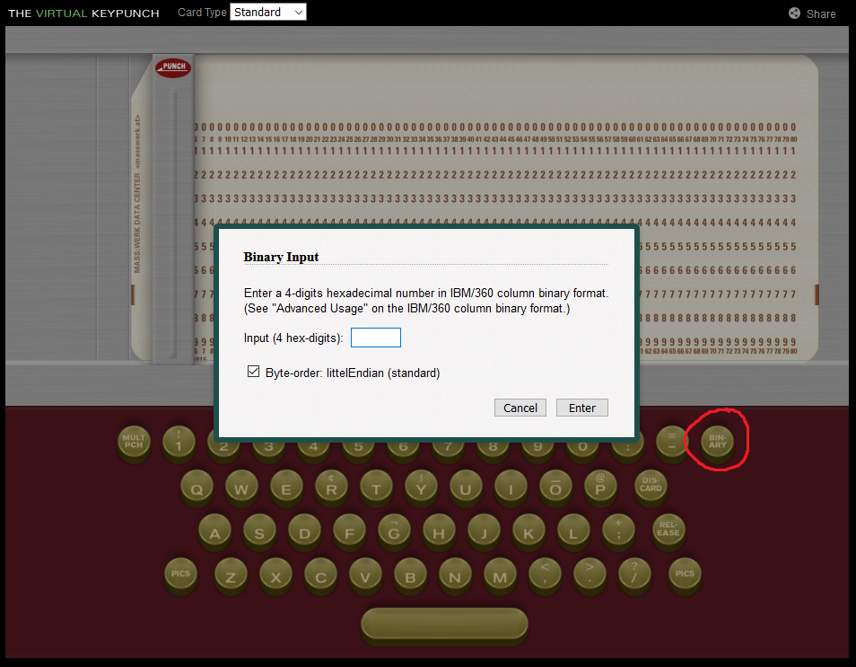
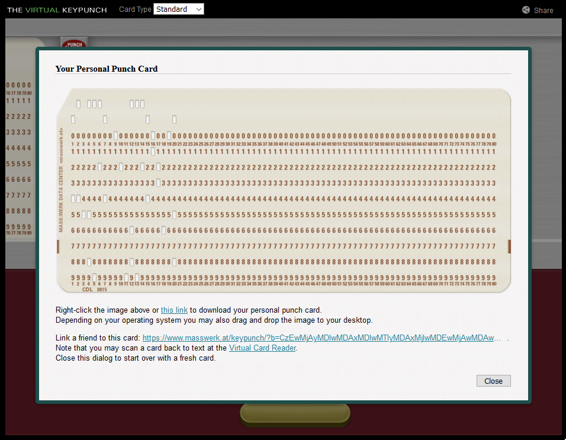
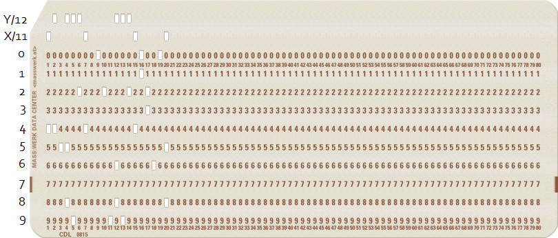
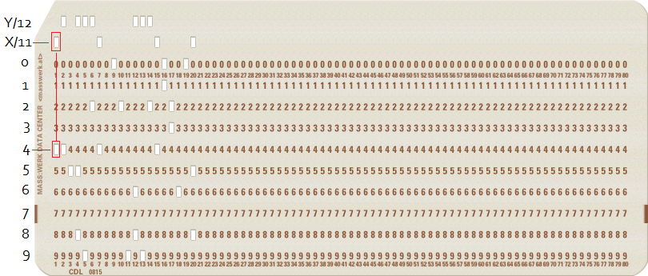
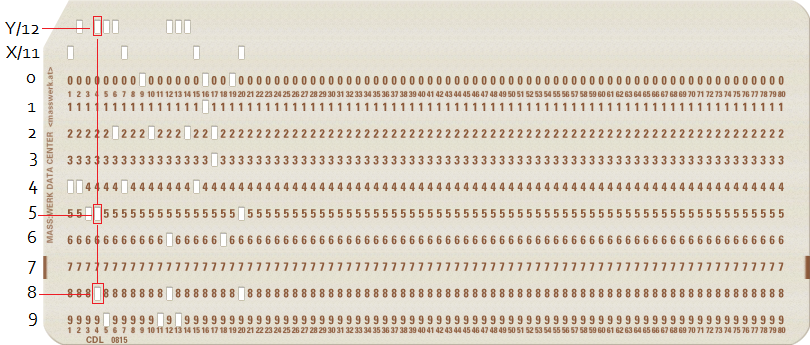

# Mystisk kort

## Oppgaven

    Se dagsbriefen: https://kalender.npst.no/20

<p><strong>Mystisk kort</strong></p>
<p>NPST har grunn til å tro at SPST har noen systemer kjørende på <strong>meget</strong> gammel hardware. Fra temmelig hemmelige kilder har vi greie på at SPST har outsourcet utviklingen av disse systemene, og får tilsendt kildekode for oppdateringen og ny funksjonalitet på postkort. NPST har nylig snappet opp et slikt kort markert <em>"360"</em>, som anntas å innholde kode av noe slag. Dessverre ser det ut til at teknikerne våre har noen hull i programmeringskunnskapene sine, de kommer rett og slett til kort. Kunne en alvebetjent sett på kortet?</p><pre><code>1020 2020 0010 2012 2001 2200 1020 0000 0800 0200 0001 200A 2001 2200 1020 0C00 0300 0008 0800 1012</code></pre><p>Om noen finner ut av det hadde NISSEN satt pris på om vedkommende kunne kjørt koden, og lagt outputen de får inn i intranettet omkranset av <code>{</code> og <code>}</code>, samt prefikset med <code>PST</code>. Eksempel: kode: <code>print("Hei, verden!")</code> → output: <code>Hei, verden!</code> → svar: <code>PST{Hei, verden!}</code>.</p>

---

## Løsningen

Her hinter oppgaven til meget gammel hardware og hullkort. Vi må også finne ut hva `360` refererer til.

Etter litt Googling finner vi ut at denne oppgaven mest sannsynlig tar oss med tilbake til 1964, da `IBM System/360` ble lansert. Etter enda mer Googling, og haugevis av forskjellige utprøvde metoder for å finne ut hvordan vi skal håndtere cipheret i oppgaven, lander vi på siden [https://www.masswerk.at/keypunch/](https://www.masswerk.at/keypunch/).



Kombinert med at forkortelsen [EBCDIC](https://en.wikipedia.org/wiki/EBCDIC) dukket opp rundt om kring i diverse søk, ender vi opp med å prøve å lage et hullkort med binærrepresentasjon av det som nå ikke lenger er et cipher, men en `EBCDIC`-input.

Punch-cardet vi får ut av nettsiden ser slik ut



Dette kortet representerer altså noe, men vi vet ikke helt hva enda. Googling tar oss med til Stack Overflow, [Decode hexadecimal number in IBM/360 column binary format](https://stackoverflow.com/questions/52612738/decode-hexadecimal-number-in-ibm-360-column-binary-format). Denne posten forteller oss hvordan et punch card av denne typen kan leses av. Det tok litt tid å skjønne greia, men etter hvert finner vi ut at det finnes flere "`punch card codes`" et kort kan bruke. Det riktige for vår oppgave viser seg å være `IBM model 029 keypunch`.

På [https://homepage.divms.uiowa.edu/~jones/cards/codes.html](https://homepage.divms.uiowa.edu/~jones/cards/codes.html) finner vi en rekke forskjellige punch card codes. Flere ble prøvd ut før vi fant ut hvilken som var den riktige.

**The IBM model 029 keypunch**

    029  &-0123456789ABCDEFGHIJKLMNOPQR/STUVWXYZ:#@'="¢.<(+|!$*);¬ ,%_>?
    IBME ¹-0123456789ABCDEFGHIJKLMNOPQR/STUVWXYZ:#²'="].<(+|[$*);¬³,%_>?
    EBCD &-0123456789ABCDEFGHIJKLMNOPQR/STUVWXYZ:#@'="[.<(+|]$*);^\,%_>?
        ________________________________________________________________
        /&-0123456789ABCDEFGHIJKLMNOPQR/STUVWXYZb#@'>V?.¤[<§!$*];^±,%v\¶
    12 / O           OOOOOOOOO                        OOOOOO            
    11|   O                   OOOOOOOOO                     OOOOOO      
     0|    O                           OOOOOOOOO                  OOOOOO
     1|     O        O        O        O                                
     2|      O        O        O        O       O     O     O     O     
     3|       O        O        O        O       O     O     O     O    
     4|        O        O        O        O       O     O     O     O   
     5|         O        O        O        O       O     O     O     O  
     6|          O        O        O        O       O     O     O     O 
     7|           O        O        O        O       O     O     O     O
     8|            O        O        O        O OOOOOOOOOOOOOOOOOOOOOOOO
     9|             O        O        O        O
      |__________________________________________________________________

Ref [http://www.jwdp.com/colbin1.html](http://www.jwdp.com/colbin1.html) brukes det litt forskjellige notasjoner for merkingen av radnavn. `12` og `11` i denne ASCII-representasjonen kan også representeres med `Y` og `X`, respektivt. Stack Overflow-posten brukte `Y` og `X`-notasjon. Armert med all denne informasjonen skjønner vi til slutt hvordan avlesningen av hullkortet fungerer



### Utlesing av hullkortet

Under følger et eksempel på hvordan kolonne 1 og 4 på kortet leses ut, så skipper vi resten og går direkte til ferdig dekodet EBCDIC.

**Første rad**



    029  &-0123456789ABCDEFGHIJKLMNOPQR/STUVWXYZ:#@'="¢.<(+|!$*);¬ ,%_>?
    IBME ¹-0123456789ABCDEFGHIJKLMNOPQR/STUVWXYZ:#²'="].<(+|[$*);¬³,%_>?
    EBCD &-0123456789ABCDEFGHIJKLMNOPQR/STUVWXYZ:#@'="[.<(+|]$*);^\,%_>?
        ________________________________________________________________
        /&-0123456789ABCDEFGHIJKLMNOPQR/STUVWXYZb#@'>V?.¤[<§!$*];^±,%v\¶
    12 / O           OOOOOOOOO   |                    OOOOOO            
    11|   O                   OOOOOOOOO                     OOOOOO      
     0|    O                     |     OOOOOOOOO                  OOOOOO
     1|     O        O        O  |     O                                
     2|      O        O        O |      O       O     O     O     O     
     3|       O        O        O|       O       O     O     O     O    
     4|--------O--------O--------O        O       O     O     O     O   
     5|         O        O        O        O       O     O     O     O  
     6|          O        O        O        O       O     O     O     O 
     7|           O        O        O        O       O     O     O     O
     8|            O        O        O        O OOOOOOOOOOOOOOOOOOOOOOOO
     9|             O        O        O        O
      |__________________________________________________________________

**Andre rad**



    029  &-0123456789ABCDEFGHIJKLMNOPQR/STUVWXYZ:#@'="¢.<(+|!$*);¬ ,%_>?
    IBME ¹-0123456789ABCDEFGHIJKLMNOPQR/STUVWXYZ:#²'="].<(+|[$*);¬³,%_>?
    EBCD &-0123456789ABCDEFGHIJKLMNOPQR/STUVWXYZ:#@'="[.<(+|]$*);^\,%_>?
        _________________________________________________|______________
        /&-0123456789ABCDEFGHIJKLMNOPQR/STUVWXYZb#@'>V?.¤[<§!$*];^±,%v\¶
    12 / O           OOOOOOOOO                        OOOOOO            
    11|   O                   OOOOOOOOO                  |  OOOOOO      
     0|    O                           OOOOOOOOO         |        OOOOOO
     1|     O        O        O        O                 |              
     2|      O        O        O        O       O     O  |  O     O     
     3|       O        O        O        O       O     O |   O     O    
     4|        O        O        O        O       O     O|    O     O   
     5|         O        O        O        O       O     O     O     O  
     6|          O        O        O        O       O    |O     O     O 
     7|           O        O        O        O       O   | O     O     O
     8|------------O--------O--------O--------O-OOOOOOOOOOOOOOOOOOOOOOOO
     9|             O        O        O        O
      |__________________________________________________________________

#### NB: Til de som fulgte ekstra godt med, så er det en feil i oppgaven. Kolonne 17 inneholder avmerkinger for både rad 2 og 3, noe som ikke går an i `IBM model 029 keypunch`. Vi bruker våre 🧠 200 IQ 🧠 for å koble hintet til `360` i oppgaven med at rad `3` er markert, og gjetter at denne kolonnen egentlig bare skal inneholde avmerking for rad `3`. 😛

### Ferdig resultat

Når vi har lest ut alle kolonnene sitter vi igjen med `MD5(IBM 029+IBM/360)`  
md5 av `IBM 029+IBM/360` er `2d0330aeddd7a66612b328b06324e3b9`

```javascript
Flagg: PST{2d0330aeddd7a66612b328b06324e3b9}
```
