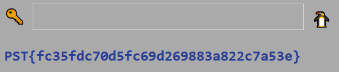

# 22. desember

## Oppgaven

    Se dagsbriefen: https://kalender.npst.no/22

<p><strong>Opptrapping av falske nyheter</strong></p>
<p>SPST har den siste tiden trappet opp sin pågående falske nyhets-kampanje. som, i følge betrodde kilder, refereres til som "Operasjon Avlys julen" internt hos SPST. Det er kritisk at vi får stoppet denne operasjonen så rask som mulig, men foreløpig har vi ikke helt oversikt over hva dette innebærer.</p><p>Analytikerne våre mener det kanskje ligger noe gjemt på SPST sin kampanje-side, men dessverre greier ikke agentene våre å finne noe. Kunne noen alvebetjeneter sett om de finner noe der?</p><p><a href="https://spst.no">https://spst.no</a></p>

---

## Løsningen

[SPST.no](https://spst.no) inneholder ikke stort. Her er det noen som vil skjule noe! Kanskje vi kan klare å finne noen spor likevel.

[robots.txt](https://www.robotstxt.org/) er en vanlig måte å gjemme undersider for indexere, slik som Google og Bing. Vi tar oss derfor en tur innom [SPSTs robot.txt](https://spst.no/robots.txt) for å sjekke om vi finner noe der.

Her finner vi ut at de prøver å gjemme undersiden [/temmelig-hemmelig/](https://spst.no/temmelig-hemmelig/)

Åpner vi siden blir vi presentert med et flagg og en input-box.



```javascript
Flagg: PST{fc35fdc70d5fc69d269883a822c7a53e}
```
