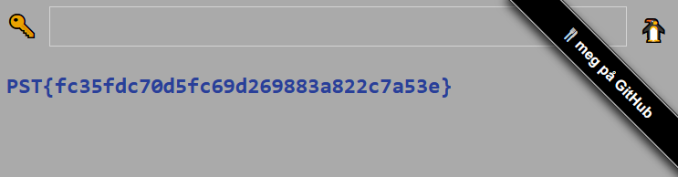
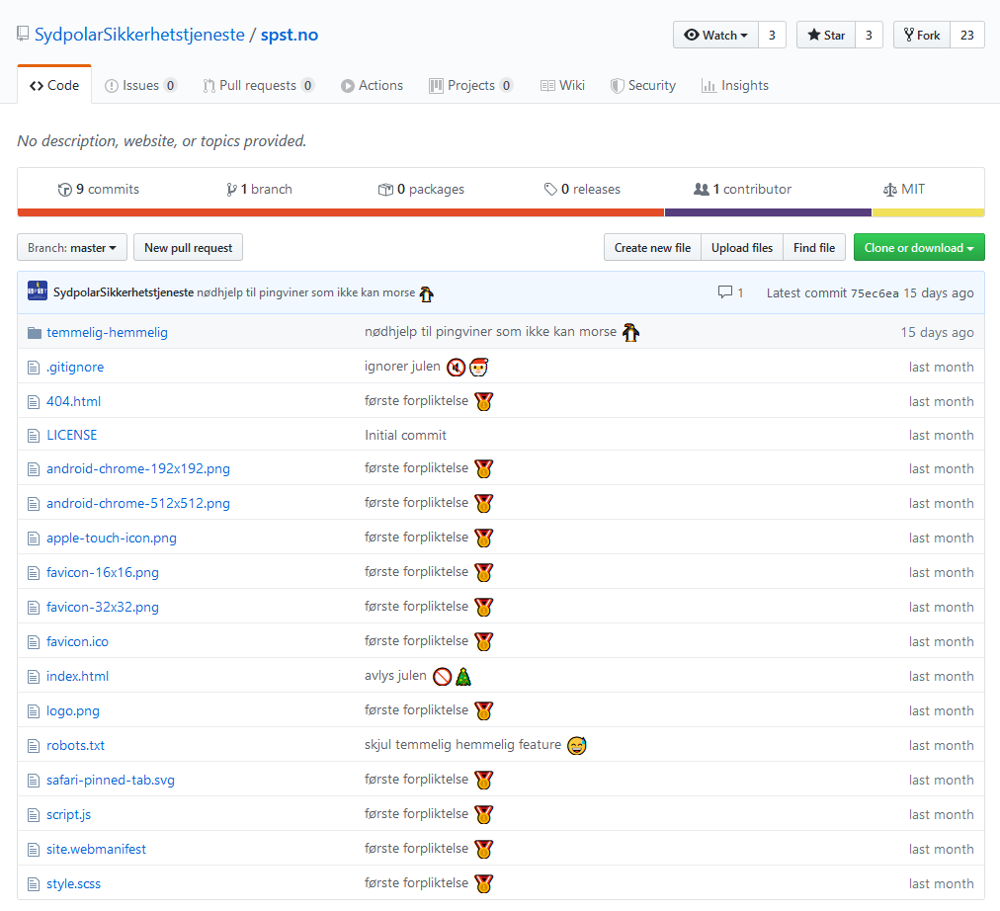
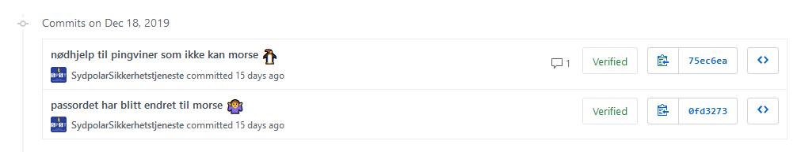
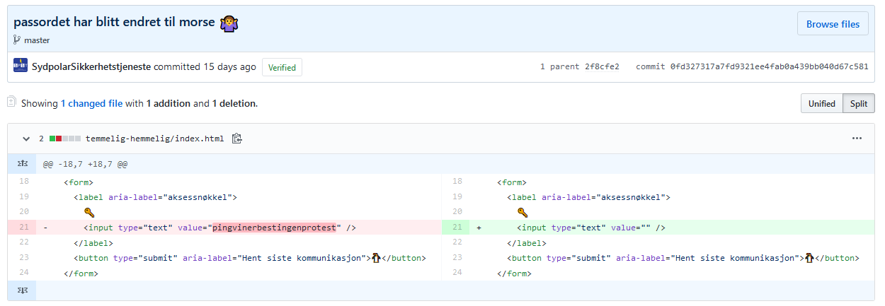
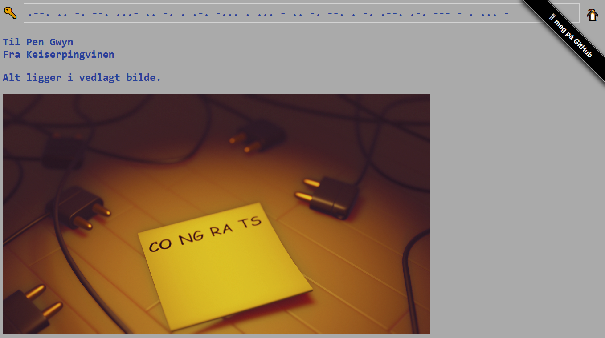
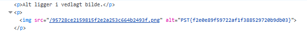

# Kildekode

## Oppgaven

    Vi er veldig interessert i hva denne applikasjonen gjør. Hadde vi bare hatt tilgang til kildekoden...

---

## Løsningen

Når vi har kommet oss inn på den temmelig hemmelige siden til SPST, er det fristende å ta en titt i kildekoden til nettsiden. Her finner vi neste steg i oppgaven. Det er ikke så mye kode å se gjennom her, men vi kan se at de har prøvd å gjemme "Fork me on github" fra oss! Linken er der i klartekst, men hvis vi fjerner noen css-properties fra elementet i DOM-en får vi se hvordan siden kanskje egentlig skal se ut




Nå er vi direkte inn i kildekoden deres, og kan finne ut hvordan de har programmert nettsiden sin.
Vi ser spor etter forrige oppgave her også, med commit-messagen "skjul temmelig hemmelig feature 😅"



Inne i commit-historien finner vi noe som ser ut som noe vi trenger. "Passordet har blitt endret til morse 🤷‍♀️"





Herfra er ikke veien lang til å åpne en [tekst-til-morsekode-oversetter](https://morsecode.world/international/translator.html) og putte inn "`pingvinerbestingenprotest`" som passordet på [/temmelig-hemmelig/](https://spst.no/temmelig-hemmelig/).

Output: `.--. .. -. --. ...- .. -. . .-. -... . ... - .. -. --. . -. .--. .-. --- - . ... -`



Her er det lett å la seg lure av filnavnet til bildet, som er `95728ce2159815f2e2a253c664b2493f.png`, og tro at flagget er `PST{95728ce2159815f2e2a253c664b2493f}`, men det er altså feil.

Løsningen er å igjen åpne kildekoden til nettsiden i developer mode i browseren, og sjekke ut `alt`-taggen til bildet.



```javascript
Flagg: PST{f2e0e89f59722af1f388529720b9db03}
```
