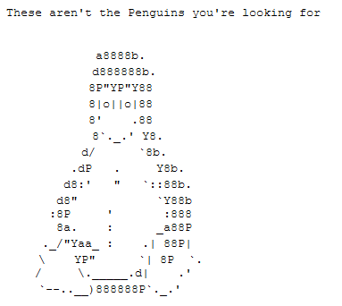
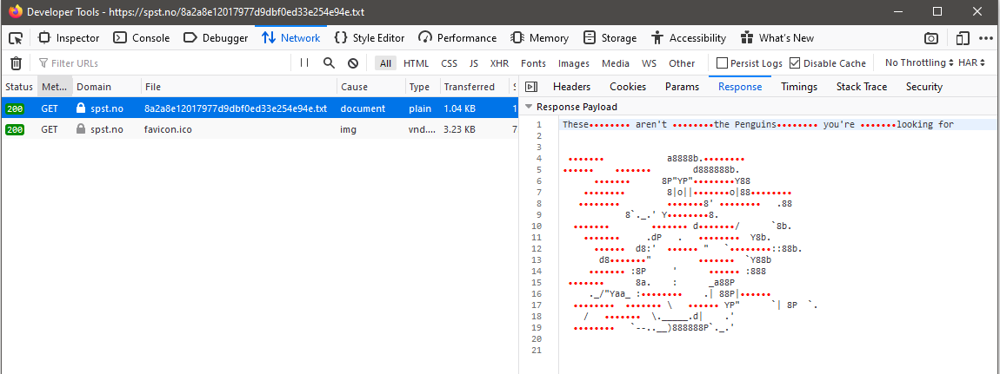
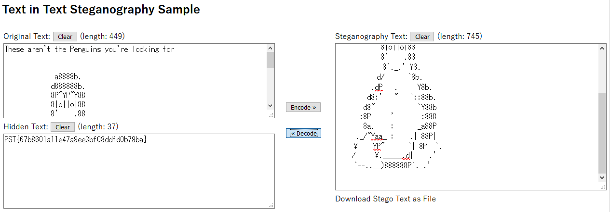

# &nbsp

## Oppgaven

    Våre analytikere mener SPST kan ha skjult informasjon for hackere som deg.

---

## Løsningen

SPST har skjult noe for oss, og det er nærliggende å tro at de har gjemt noe inne i et bilde igjen.


Vi går til samme side som vi brukte sist for [steganografi](https://en.wikipedia.org/wiki/Steganography), [https://stylesuxx.github.io/steganography/](https://stylesuxx.github.io/steganography/)

Når vi laser opp bildet til dekoderen får vi ut denne meldingen

                SSSSSSSSSSSSSSSSSSSSSSSSSSSS        SSSS                SSSS    SSSS    SSSSSSSSSSSS    SSSSSSSSSSSSSSSSSSSSSSSSSSSS                
                SSSSSSSSSSSSSSSSSSSSSSSSSSSS        SSSS                SSSS    SSSS    SSSSSSSSSSSS    SSSSSSSSSSSSSSSSSSSSSSSSSSSS                
                SSSSSSSSSSSSSSSSSSSSSSSSSSSS        SSSS                SSSS    SSSS    SSSSSSSSSSSS    SSSSSSSSSSSSSSSSSSSSSSSSSSSS                
                SSSSSSSSSSSSSSSSSSSSSSSSSSSS        SSSS                SSSS    SSSS    SSSSSSSSSSSS    SSSSSSSSSSSSSSSSSSSSSSSSSSSS                
                SSSS                    SSSS    SSSSSSSS    SSSSSSSS    SSSSSSSS                SSSS    SSSS                    SSSS                
                SSSS                    SSSS    SSSSSSSS    SSSSSSSS    SSSSSSSS                SSSS    SSSS                    SSSS                
                SSSS                    SSSS    SSSSSSSS    SSSSSSSS    SSSSSSSS                SSSS    SSSS                    SSSS                
                SSSS                    SSSS    SSSSSSSS    SSSSSSSS    SSSSSSSS                SSSS    SSSS                    SSSS                
                SSSS    SSSSSSSSSSSS    SSSS        SSSSSSSSSSSS            SSSS        SSSS    SSSS    SSSS    SSSSSSSSSSSS    SSSS                
                SSSS    SSSSSSSSSSSS    SSSS        SSSSSSSSSSSS            SSSS        SSSS    SSSS    SSSS    SSSSSSSSSSSS    SSSS                
                SSSS    SSSSSSSSSSSS    SSSS        SSSSSSSSSSSS            SSSS        SSSS    SSSS    SSSS    SSSSSSSSSSSS    SSSS                
                SSSS    SSSSSSSSSSSS    SSSS        SSSSSSSSSSSS            SSSS        SSSS    SSSS    SSSS    SSSSSSSSSSSS    SSSS                
                SSSS    SSSSSSSSSSSS    SSSS    SSSSSSSS    SSSS                SSSSSSSSSSSS            SSSS    SSSSSSSSSSSS    SSSS                
                SSSS    SSSSSSSSSSSS    SSSS    SSSSSSSS    SSSS                SSSSSSSSSSSS            SSSS    SSSSSSSSSSSS    SSSS                
                SSSS    SSSSSSSSSSSS    SSSS    SSSSSSSS    SSSS                SSSSSSSSSSSS            SSSS    SSSSSSSSSSSS    SSSS                
                SSSS    SSSSSSSSSSSS    SSSS    SSSSSSSS    SSSS                SSSSSSSSSSSS            SSSS    SSSSSSSSSSSS    SSSS                
                SSSS    SSSSSSSSSSSS    SSSS            SSSS    SSSSSSSS        SSSS        SSSSSSSS    SSSS    SSSSSSSSSSSS    SSSS                
                SSSS    SSSSSSSSSSSS    SSSS            SSSS    SSSSSSSS        SSSS        SSSSSSSS    SSSS    SSSSSSSSSSSS    SSSS                
                SSSS    SSSSSSSSSSSS    SSSS            SSSS    SSSSSSSS        SSSS        SSSSSSSS    SSSS    SSSSSSSSSSSS    SSSS                
                SSSS    SSSSSSSSSSSS    SSSS            SSSS    SSSSSSSS        SSSS        SSSSSSSS    SSSS    SSSSSSSSSSSS    SSSS                
                SSSS                    SSSS    SSSS    SSSS        SSSSSSSSSSSS    SSSSSSSS            SSSS                    SSSS                
                SSSS                    SSSS    SSSS    SSSS        SSSSSSSSSSSS    SSSSSSSS            SSSS                    SSSS                
                SSSS                    SSSS    SSSS    SSSS        SSSSSSSSSSSS    SSSSSSSS            SSSS                    SSSS                
                SSSS                    SSSS    SSSS    SSSS        SSSSSSSSSSSS    SSSSSSSS            SSSS                    SSSS                
                SSSSSSSSSSSSSSSSSSSSSSSSSSSS    SSSS    SSSS    SSSS    SSSS    SSSS    SSSS    SSSS    SSSSSSSSSSSSSSSSSSSSSSSSSSSS                
                SSSSSSSSSSSSSSSSSSSSSSSSSSSS    SSSS    SSSS    SSSS    SSSS    SSSS    SSSS    SSSS    SSSSSSSSSSSSSSSSSSSSSSSSSSSS                
                SSSSSSSSSSSSSSSSSSSSSSSSSSSS    SSSS    SSSS    SSSS    SSSS    SSSS    SSSS    SSSS    SSSSSSSSSSSSSSSSSSSSSSSSSSSS                
                SSSSSSSSSSSSSSSSSSSSSSSSSSSS    SSSS    SSSS    SSSS    SSSS    SSSS    SSSS    SSSS    SSSSSSSSSSSSSSSSSSSSSSSSSSSS                
                                                                SSSSSSSS    SSSSSSSS                                                                
                                                                SSSSSSSS    SSSSSSSS                                                                
                                                                SSSSSSSS    SSSSSSSS                                                                
                                                                SSSSSSSS    SSSSSSSS                                                                
                SSSSSSSSSSSSSSSSSSSS    SSSSSSSSSSSSSSSSSSSS    SSSS    SSSSSSSSSSSSSSSSSSSS    SSSSSSSS    SSSS    SSSS    SSSS                    
                SSSSSSSSSSSSSSSSSSSS    SSSSSSSSSSSSSSSSSSSS    SSSS    SSSSSSSSSSSSSSSSSSSS    SSSSSSSS    SSSS    SSSS    SSSS                    
                SSSSSSSSSSSSSSSSSSSS    SSSSSSSSSSSSSSSSSSSS    SSSS    SSSSSSSSSSSSSSSSSSSS    SSSSSSSS    SSSS    SSSS    SSSS                    
                SSSSSSSSSSSSSSSSSSSS    SSSSSSSSSSSSSSSSSSSS    SSSS    SSSSSSSSSSSSSSSSSSSS    SSSSSSSS    SSSS    SSSS    SSSS                    
                    SSSSSSSSSSSS    SSSS            SSSS                        SSSS        SSSS        SSSS    SSSS            SSSS                
                    SSSSSSSSSSSS    SSSS            SSSS                        SSSS        SSSS        SSSS    SSSS            SSSS                
                    SSSSSSSSSSSS    SSSS            SSSS                        SSSS        SSSS        SSSS    SSSS            SSSS                
                    SSSSSSSSSSSS    SSSS            SSSS                        SSSS        SSSS        SSSS    SSSS            SSSS                
                    SSSSSSSS    SSSSSSSSSSSS    SSSSSSSS    SSSSSSSS        SSSS    SSSSSSSS        SSSSSSSSSSSS        SSSSSSSS                    
                    SSSSSSSS    SSSSSSSSSSSS    SSSSSSSS    SSSSSSSS        SSSS    SSSSSSSS        SSSSSSSSSSSS        SSSSSSSS                    
                    SSSSSSSS    SSSSSSSSSSSS    SSSSSSSS    SSSSSSSS        SSSS    SSSSSSSS        SSSSSSSSSSSS        SSSSSSSS                    
                    SSSSSSSS    SSSSSSSSSSSS    SSSSSSSS    SSSSSSSS        SSSS    SSSSSSSS        SSSSSSSSSSSS        SSSSSSSS                    
                    SSSS    SSSS    SSSS            SSSSSSSSSSSS        SSSS    SSSS        SSSSSSSS        SSSSSSSSSSSS                            
                    SSSS    SSSS    SSSS            SSSSSSSSSSSS        SSSS    SSSS        SSSSSSSS        SSSSSSSSSSSS                            
                    SSSS    SSSS    SSSS            SSSSSSSSSSSS        SSSS    SSSS        SSSSSSSS        SSSSSSSSSSSS                            
                    SSSS    SSSS    SSSS            SSSSSSSSSSSS        SSSS    SSSS        SSSSSSSS        SSSSSSSSSSSS                            
                                    SSSSSSSSSSSS    SSSS    SSSS                    SSSS            SSSS    SSSS        SSSSSSSS                    
                                    SSSSSSSSSSSS    SSSS    SSSS                    SSSS            SSSS    SSSS        SSSSSSSS                    
                                    SSSSSSSSSSSS    SSSS    SSSS                    SSSS            SSSS    SSSS        SSSSSSSS                    
                                    SSSSSSSSSSSS    SSSS    SSSS                    SSSS            SSSS    SSSS        SSSSSSSS                    
                SSSSSSSSSSSSSSSSSSSSSSSS    SSSS        SSSS    SSSSSSSSSSSS            SSSSSSSSSSSS    SSSS    SSSS        SSSSSSSS                
                SSSSSSSSSSSSSSSSSSSSSSSS    SSSS        SSSS    SSSSSSSSSSSS            SSSSSSSSSSSS    SSSS    SSSS        SSSSSSSS                
                SSSSSSSSSSSSSSSSSSSSSSSS    SSSS        SSSS    SSSSSSSSSSSS            SSSSSSSSSSSS    SSSS    SSSS        SSSSSSSS                
                SSSSSSSSSSSSSSSSSSSSSSSS    SSSS        SSSS    SSSSSSSSSSSS            SSSSSSSSSSSS    SSSS    SSSS        SSSSSSSS                
                    SSSS    SSSS        SSSS        SSSSSSSS        SSSSSSSSSSSSSSSS                        SSSSSSSSSSSS                            
                    SSSS    SSSS        SSSS        SSSSSSSS        SSSSSSSSSSSSSSSS                        SSSSSSSSSSSS                            
                    SSSS    SSSS        SSSS        SSSSSSSS        SSSSSSSSSSSSSSSS                        SSSSSSSSSSSS                            
                    SSSS    SSSS        SSSS        SSSSSSSS        SSSSSSSSSSSSSSSS                        SSSSSSSSSSSS                            
                SSSSSSSSSSSS    SSSS            SSSSSSSS        SSSSSSSS    SSSSSSSS        SSSS        SSSS    SSSS        SSSS                    
                SSSSSSSSSSSS    SSSS            SSSSSSSS        SSSSSSSS    SSSSSSSS        SSSS        SSSS    SSSS        SSSS                    
                SSSSSSSSSSSS    SSSS            SSSSSSSS        SSSSSSSS    SSSSSSSS        SSSS        SSSS    SSSS        SSSS                    
                SSSSSSSSSSSS    SSSS            SSSSSSSS        SSSSSSSS    SSSSSSSS        SSSS        SSSS    SSSS        SSSS                    
                SSSSSSSSSSSS    SSSSSSSSSSSS    SSSS    SSSS    SSSS    SSSSSSSS    SSSSSSSS        SSSS    SSSS    SSSSSSSSSSSSSSSS                
                SSSSSSSSSSSS    SSSSSSSSSSSS    SSSS    SSSS    SSSS    SSSSSSSS    SSSSSSSS        SSSS    SSSS    SSSSSSSSSSSSSSSS                
                SSSSSSSSSSSS    SSSSSSSSSSSS    SSSS    SSSS    SSSS    SSSSSSSS    SSSSSSSS        SSSS    SSSS    SSSSSSSSSSSSSSSS                
                SSSSSSSSSSSS    SSSSSSSSSSSS    SSSS    SSSS    SSSS    SSSSSSSS    SSSSSSSS        SSSS    SSSS    SSSSSSSSSSSSSSSS                
                SSSSSSSS    SSSSSSSSSSSS    SSSS        SSSS                    SSSS        SSSSSSSS    SSSS    SSSS    SSSS    SSSS                
                SSSSSSSS    SSSSSSSSSSSS    SSSS        SSSS                    SSSS        SSSSSSSS    SSSS    SSSS    SSSS    SSSS                
                SSSSSSSS    SSSSSSSSSSSS    SSSS        SSSS                    SSSS        SSSSSSSS    SSSS    SSSS    SSSS    SSSS                
                SSSSSSSS    SSSSSSSSSSSS    SSSS        SSSS                    SSSS        SSSSSSSS    SSSS    SSSS    SSSS    SSSS                
                SSSS        SSSS        SSSS                SSSSSSSS        SSSS    SSSSSSSS                    SSSS        SSSS                    
                SSSS        SSSS        SSSS                SSSSSSSS        SSSS    SSSSSSSS                    SSSS        SSSS                    
                SSSS        SSSS        SSSS                SSSSSSSS        SSSS    SSSSSSSS                    SSSS        SSSS                    
                SSSS        SSSS        SSSS                SSSSSSSS        SSSS    SSSSSSSS                    SSSS        SSSS                    
                SSSS    SSSSSSSS    SSSS        SSSS        SSSS        SSSSSSSSSSSS    SSSS    SSSS    SSSS    SSSSSSSS        SSSS                
                SSSS    SSSSSSSS    SSSS        SSSS        SSSS        SSSSSSSSSSSS    SSSS    SSSS    SSSS    SSSSSSSS        SSSS                
                SSSS    SSSSSSSS    SSSS        SSSS        SSSS        SSSSSSSSSSSS    SSSS    SSSS    SSSS    SSSSSSSS        SSSS                
                SSSS    SSSSSSSS    SSSS        SSSS        SSSS        SSSSSSSSSSSS    SSSS    SSSS    SSSS    SSSSSSSS        SSSS                
                SSSS    SSSS        SSSSSSSSSSSS    SSSS    SSSS            SSSSSSSSSSSSSSSS    SSSSSSSSSSSSSSSSSSSS    SSSS    SSSS                
                SSSS    SSSS        SSSSSSSSSSSS    SSSS    SSSS            SSSSSSSSSSSSSSSS    SSSSSSSSSSSSSSSSSSSS    SSSS    SSSS                
                SSSS    SSSS        SSSSSSSSSSSS    SSSS    SSSS            SSSSSSSSSSSSSSSS    SSSSSSSSSSSSSSSSSSSS    SSSS    SSSS                
                SSSS    SSSS        SSSSSSSSSSSS    SSSS    SSSS            SSSSSSSSSSSSSSSS    SSSSSSSSSSSSSSSSSSSS    SSSS    SSSS                
                                                SSSS    SSSS    SSSSSSSSSSSS                    SSSS            SSSSSSSS    SSSSSSSS                
                                                SSSS    SSSS    SSSSSSSSSSSS                    SSSS            SSSSSSSS    SSSSSSSS                
                                                SSSS    SSSS    SSSSSSSSSSSS                    SSSS            SSSSSSSS    SSSSSSSS                
                                                SSSS    SSSS    SSSSSSSSSSSS                    SSSS            SSSSSSSS    SSSSSSSS                
                SSSSSSSSSSSSSSSSSSSSSSSSSSSS    SSSSSSSS            SSSSSSSSSSSSSSSS        SSSSSSSS    SSSS    SSSSSSSS    SSSS                    
                SSSSSSSSSSSSSSSSSSSSSSSSSSSS    SSSSSSSS            SSSSSSSSSSSSSSSS        SSSSSSSS    SSSS    SSSSSSSS    SSSS                    
                SSSSSSSSSSSSSSSSSSSSSSSSSSSS    SSSSSSSS            SSSSSSSSSSSSSSSS        SSSSSSSS    SSSS    SSSSSSSS    SSSS                    
                SSSSSSSSSSSSSSSSSSSSSSSSSSSS    SSSSSSSS            SSSSSSSSSSSSSSSS        SSSSSSSS    SSSS    SSSSSSSS    SSSS                    
                SSSS                    SSSS                    SSSSSSSS    SSSS            SSSSSSSS            SSSS                                
                SSSS                    SSSS                    SSSSSSSS    SSSS            SSSSSSSS            SSSS                                
                SSSS                    SSSS                    SSSSSSSS    SSSS            SSSSSSSS            SSSS                                
                SSSS                    SSSS                    SSSSSSSS    SSSS            SSSSSSSS            SSSS                                
                SSSS    SSSSSSSSSSSS    SSSS    SSSS            SSSS    SSSS    SSSSSSSSSSSS    SSSSSSSSSSSSSSSSSSSSSSSSSSSS                        
                SSSS    SSSSSSSSSSSS    SSSS    SSSS            SSSS    SSSS    SSSSSSSSSSSS    SSSSSSSSSSSSSSSSSSSSSSSSSSSS                        
                SSSS    SSSSSSSSSSSS    SSSS    SSSS            SSSS    SSSS    SSSSSSSSSSSS    SSSSSSSSSSSSSSSSSSSSSSSSSSSS                        
                SSSS    SSSSSSSSSSSS    SSSS    SSSS            SSSS    SSSS    SSSSSSSSSSSS    SSSSSSSSSSSSSSSSSSSSSSSSSSSS                        
                SSSS    SSSSSSSSSSSS    SSSS    SSSSSSSSSSSS                                SSSS            SSSS            SSSSSSSS                
                SSSS    SSSSSSSSSSSS    SSSS    SSSSSSSSSSSS                                SSSS            SSSS            SSSSSSSS                
                SSSS    SSSSSSSSSSSS    SSSS    SSSSSSSSSSSS                                SSSS            SSSS            SSSSSSSS                
                SSSS    SSSSSSSSSSSS    SSSS    SSSSSSSSSSSS                                SSSS            SSSS            SSSSSSSS                
                SSSS    SSSSSSSSSSSS    SSSS    SSSSSSSS    SSSSSSSS        SSSSSSSS            SSSSSSSSSSSS    SSSSSSSS    SSSS                    
                SSSS    SSSSSSSSSSSS    SSSS    SSSSSSSS    SSSSSSSS        SSSSSSSS            SSSSSSSSSSSS    SSSSSSSS    SSSS                    
                SSSS    SSSSSSSSSSSS    SSSS    SSSSSSSS    SSSSSSSS        SSSSSSSS            SSSSSSSSSSSS    SSSSSSSS    SSSS                    
                SSSS    SSSSSSSSSSSS    SSSS    SSSSSSSS    SSSSSSSS        SSSSSSSS            SSSSSSSSSSSS    SSSSSSSS    SSSS                    
                SSSS                    SSSS    SSSS        SSSS        SSSSSSSSSSSS    SSSSSSSSSSSS                        SSSS                    
                SSSS                    SSSS    SSSS        SSSS        SSSSSSSSSSSS    SSSSSSSSSSSS                        SSSS                    
                SSSS                    SSSS    SSSS        SSSS        SSSSSSSSSSSS    SSSSSSSSSSSS                        SSSS                    
                SSSS                    SSSS    SSSS        SSSS        SSSSSSSSSSSS    SSSSSSSSSSSS                        SSSS                    
                SSSSSSSSSSSSSSSSSSSSSSSSSSSS    SSSSSSSS    SSSS            SSSS    SSSS            SSSS        SSSSSSSSSSSS                        
                SSSSSSSSSSSSSSSSSSSSSSSSSSSS    SSSSSSSS    SSSS            SSSS    SSSS            SSSS        SSSSSSSSSSSS                        
                SSSSSSSSSSSSSSSSSSSSSSSSSSSS    SSSSSSSS    SSSS            SSSS    SSSS            SSSS        SSSSSSSSSSSS                        
                SSSSSSSSSSSSSSSSSSSSSSSSSSSS    SSSSSSSS    SSSS            SSSS    SSSS            SSSS        SSSSSSSSSSSS                        
Dette ser veldig ut som en [QR-kode](https://en.wikipedia.org/wiki/QR_code)!
Vi skriver litt C#-kode for å gjøre QR-koden leselig for QR-kode-scannere.

```csharp
using System.Drawing;
using System.IO;

namespace npst.qrcode
{
    class Program
    {
        static void Main(string[] args)
        {
            // read all the lines
            var lines = File.ReadAllLines(@"qrcode.txt");
            // create empty bitmap
            var image = new Bitmap(148, 148);

            for (var lineIndex = 0; lineIndex < lines.Length; lineIndex++)
            {
                // go through every character in a line
                for (var i = 0; i < 148; i++)
                {
                    // If the char is empty, white color, else black
                    var line = lines[lineIndex];
                    if (line[i] == ' ')
                        image.SetPixel(i, lineIndex, Color.White);
                    else
                        image.SetPixel(i, lineIndex, Color.Black);
                }
            }

            image.Save(@"qrcode.png");
        }
    }
}
```

### Output


Scanner vi denne QR-koden får vi dette som resultat: `/8a2a8e12017977d9dbf0ed33e254e94e.txt`
Vi åpner opp [https://spst.no/8a2a8e12017977d9dbf0ed33e254e94e.txt](https://spst.no/8a2a8e12017977d9dbf0ed33e254e94e.txt) og blir møtt med et litt sørgelig syn.



Tilsynelatende er det `404 Not Found`-siden til SPST. Åpner vi en hvilken som helst annen url får vi også dette resultatet. Æsj, det kan se ut som om vi er stuck. Og stuck var jeg lenge, helt til jeg oppdaget at URL-en vi fikk oppgitt ikke returnerer `404`, men faktisk gir `200 OK`! Hidden in plain(text) sight!

Kikker vi på responsen i network-tabben finner vi dette



Her er det noen ekstra tegn! Vi gjør et forsøk på å prøve å finne ut hvilke tegn dette er.
En kjapp snutt i nodejs for å finne ut verdiene til alle tegn i filen

```javascript
const lines = require("fs").readFileSync("./8a2a8e12017977d9dbf0ed33e254e94e.txt").toString().split("\n");

for (var line of lines) {
    for (var char of line) {
        process.stdout.write(parseInt(char.charCodeAt(0)) + ", ");
    }
}
```

### Output

    84, 104, 101, 115, 101, 8204, 8204, 8204, 8204, 8205, 8205, 8204, 8204, 32, 97, 114, 101, 110, 39, 116, 32, 8204, 8204, 8204, 8204, 8205, 8205, 8204, 65279, 116, 104, 101, 32, 80, 101, 110, 103, 117, 105, 110, 115, 8204, 8204, 8204, 8204, 8205, 8205, 8205, 8204, 32, 121, 111, 117, 39, 114, 101, 32, 8204, 8204, 8204, 8204, 8205, 65279, 8236, 65279, 108, 111, 111, 107, 105, 110, 103, 32, 102, 111, 114, 32, 8204, 8204, 8204, 8204, 8204, 65279, 8205, 8236, 32, 32, 32, 32, 32, 32, 32, 32, 32, 32, 32, 32, 97, 56, 56, 56, 56, 98, 46, 8204, 8204, 8204, 8204, 8204, 65279, 8205, 65279, 8204, 8204, 8204, 8204, 8205, 8236, 8204, 8236, 32, 32, 32, 32, 8204, 8204, 8204, 8204, 8204, 65279, 8236, 8204, 32, 32, 32, 32, 32, 32, 32, 32, 100, 56, 56, 56, 56, 56, 56, 98, 46, 32, 32, 32, 32, 32, 32, 8204, 8204, 8204, 8204, 8204, 65279, 8205, 8236, 32, 32, 32, 32, 32, 32, 56, 80, 34, 89, 80, 34, 8204, 8204, 8204, 8204, 8204, 65279, 8204, 8204, 89, 56, 56, 32, 32, 32, 32, 8204, 8204, 8204, 8204, 8204, 65279, 8204, 8205, 32, 32, 32, 32, 32, 32, 32, 32, 56, 124, 111, 124, 124, 8204, 8204, 8204, 8204, 8205, 8236, 8204, 8205, 111, 124, 56, 56, 8204, 8204, 8204, 8204, 8204, 65279, 8204, 8205, 32, 32, 32, 8204, 8204, 8204, 8204, 8204, 65279, 8204, 8205, 32, 32, 32, 32, 32, 32, 32, 32, 32, 8204, 8204, 8204, 8204, 8205, 8236, 8205, 8205, 56, 39, 32, 8204, 8204, 8204, 8204, 8204, 65279, 8205, 8204, 32, 32, 32, 46, 56, 56, 32, 32, 32, 32, 32, 32, 32, 32, 32, 32, 32, 32, 56, 96, 46, 95, 46, 39, 32, 89, 8204, 8204, 8204, 8204, 8204, 65279, 8205, 65279, 56, 46, 32, 32, 8204, 8204, 8204, 8204, 8205, 8236, 8204, 8205, 32, 32, 32, 32, 32, 32, 32, 32, 8204, 8204, 8204, 8204, 8204, 65279, 8236, 8205, 32, 100, 8204, 8204, 8204, 8204, 8205, 8236, 8205, 8205, 47, 32, 32, 32, 32, 32, 32, 96, 56, 98, 46, 32, 32, 32, 32, 8204, 8204, 8204, 8204, 8205, 8236, 8205, 8205, 32, 32, 32, 32, 32, 46, 100, 80, 32, 32, 32, 46, 32, 32, 32, 8204, 8204, 8204, 8204, 8204, 65279, 8204, 65279, 32, 32, 89, 56, 98, 46, 32, 32, 32, 32, 32, 32, 8204, 8204, 8204, 8204, 8205, 8236, 8204, 8236, 32, 32, 100, 56, 58, 39, 32, 32, 8204, 8204, 8204, 8204, 8205, 8236, 8205, 8236, 32, 34, 32, 32, 32, 96, 8204, 8204, 8204, 8204, 8204, 65279, 8204, 8204, 58, 58, 56, 56, 98, 46, 32, 32, 32, 32, 32, 32, 32, 100, 56, 8204, 8204, 8204, 8204, 8204, 65279, 8236, 8204, 34, 32, 32, 32, 32, 32, 32, 32, 32, 32, 8204, 8204, 8204, 8204, 8205, 8236, 8205, 8204, 32, 32, 96, 89, 56, 56, 98, 32, 32, 32, 32, 32, 8204, 8204, 8204, 8204, 8205, 8236, 8205, 8204, 32, 58, 56, 80, 32, 32, 32, 32, 32, 39, 32, 32, 32, 32, 32, 32, 8204, 8204, 8204, 8204, 8205, 8236, 8205, 8236, 32, 58, 56, 56, 56, 32, 8204, 8204, 8204, 8204, 8205, 8236, 8205, 8204, 32, 32, 32, 32, 32, 32, 56, 97, 46, 32, 32, 32, 32, 58, 32, 32, 32, 32, 32, 32, 95, 97, 56, 56, 80, 32, 32, 32, 32, 32, 46, 95, 47, 34, 89, 97, 97, 95, 32, 58, 8204, 8204, 8204, 8204, 8204, 65279, 8204, 8204, 32, 32, 32, 32, 46, 124, 32, 56, 56, 80, 124, 8204, 8204, 8204, 8204, 8205, 8236, 8204, 8236, 32, 32, 8204, 8204, 8204, 8204, 8204, 65279, 8205, 65279, 32, 32, 8204, 8204, 8204, 8204, 8204, 65279, 8236, 8205, 32, 92, 32, 32, 32, 8204, 8204, 8204, 8204, 8205, 8236, 8204, 8236, 32, 89, 80, 34, 32, 32, 32, 32, 32, 32, 96, 124, 32, 56, 80, 32, 32, 96, 46, 32, 32, 32, 32, 47, 32, 32, 32, 8204, 8204, 8204, 8204, 8205, 8236, 8204, 8205, 32, 32, 92, 46, 95, 95, 95, 95, 95, 46, 100, 124, 32, 32, 32, 32, 46, 39, 32, 32, 8204, 8204, 8204, 8204, 8205, 65279, 65279, 8205, 32, 32, 32, 96, 45, 45, 46, 46, 95, 95, 41, 56, 56, 56, 56, 56, 56, 80, 96, 46, 95, 46, 39, 32, 32,

Neste steg blir å finne ut hvilke tegn disse egentlig er, de ser til å være i langt oppe i Unicode-range. Vi googler:

    Search: 8204 unicode
    Result: Unicode Character 'ZERO WIDTH NON-JOINER' (U+200C)

    Search: 8205 unicode
    Result: Symbol Name:  Zero Width Joiner

Etter å ikke ha skjønt noen ting en god stund, finner vi til slutt ut at man kan bruke steganografi for tekst også, ikke bare bilder! Mer spesifikt finnes det en metode for å bruke `Zero width characters` til steganografi.

[https://330k.github.io/misc_tools/unicode_steganography.html](https://330k.github.io/misc_tools/unicode_steganography.html) lar oss dekode dette mysteriet



```javascript
Flagg: PST{67b8601a11e47a9ee3bf08ddfd0b79ba}
```
