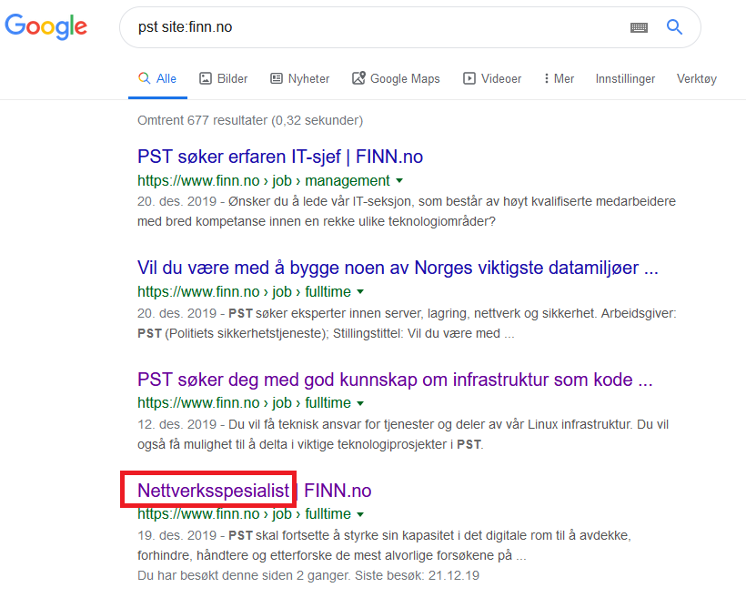

# Fragmentert samtale

## Oppgaven

    Se dagsbriefen: https://kalender.npst.no/23

<p><strong>Mystisk julekort</strong></p><p>Jule NISSEN fikk i går et meget spesielt julekort levert i den elektroniske postkassen hans. Julekortet har ingen bakside, og derfor heller ingen tekst knyttet til seg. </p><p>Klarer du å finne ut noe mer om avsender e.l.?</p><p><a href="./assets/30.png">Last ned julekort</a></p><p><strong>Fragmentert samtale</strong></p><p>Arbeidet som ble gjort 21. desember rundt avdekking av feil ved SPST sitt nye kryptosystem, har gjort oss i stand til å snappe opp en samtale mellom to høytstående SPST-agenter. Teknikerne våre er dessverre på ferie, og vi greier ikke dekode meldingen helt, kunne noen alvebetjenter hørt på det?<br>Vi har misstanke om at det utveksles en kode, og at denne koden kan benyttes for å finn'e en artikkel av noe slag. Analytekerne våre mener det er artikkelens navn som er av interesse. Om noen finner ut av det, legg inn md5-hashen av tittelen på artikkelen dere finn'er.</p><p><a href="./assets/finn_koden.zip">Last ned PCAP</a></p><p>Eksempel:<br>tittel: <code>"Gløgg og pepperkaker"</code> → svar: <code>PST{md5("Gløgg og pepperkaker")}</code> = <code>PST{9612ad6af8b6d78045b840b3c477d004}</code></p>

---

## Løsningen

Denne ble ikke løst på skikkelig måte. Vi klarte å finne flagget ved å tolke de _veldig tydelige_ hintene i oppgaven om at løsningen var en artikkelheader på Finn.no. Artikkelnavnet var såppass spesifikt for det oppgaven dreier seg om (roting i pakker med nettverkstrafikk), at vi måtte prøve, og siden er ikke oppgaven løst 🙈🙈🙈



md5 av `Nettverksspesialist`: `0844d949169d24679a1f0438f89c69e3`

```javascript
Flagg: PST{0844d949169d24679a1f0438f89c69e3}
```
