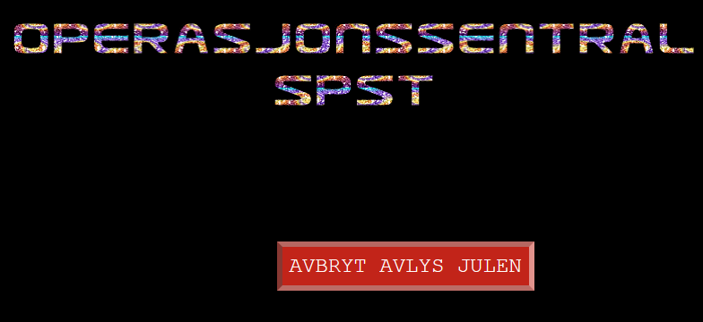
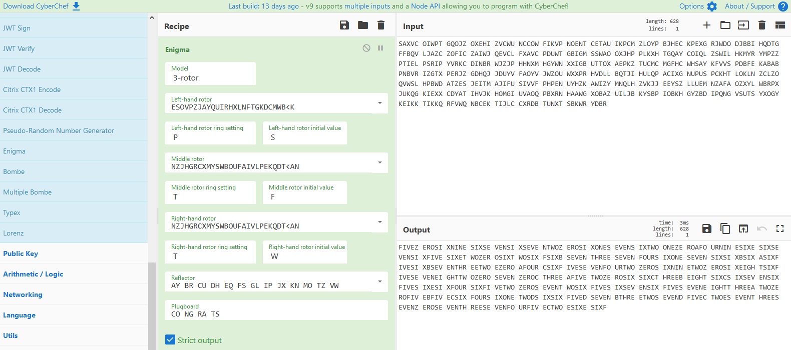
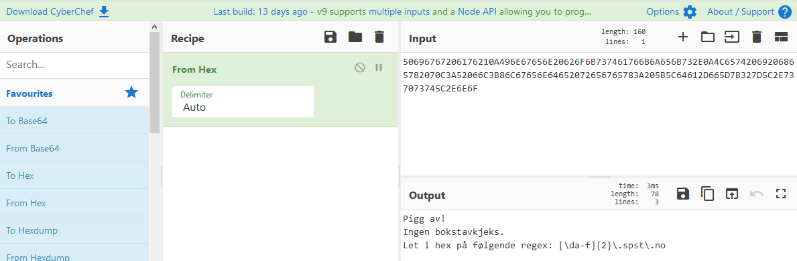
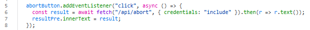
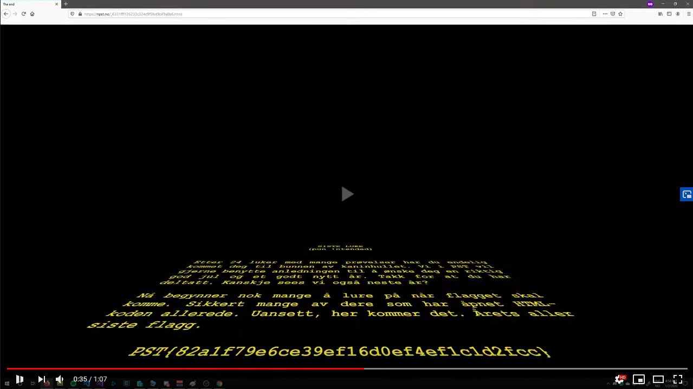

# 24. desember

## Oppgaven

    Se dagsbriefen: https://kalender.npst.no/24

<p><strong>Operasjon Avlys julen</strong></p><p>Situasjonen rundt SPSTs operasjon "Avlys julen" har eskalert, og vi må sette inn umiddelbare tiltak for å få stoppet den. Betrodde kilder sier det hele styres fra SPSTs digitale operasjonssentral. Keiserpingvinens mange reiser ryktes det at operasjonssentralen er åpent tilgjengelig fra hele verden, men at den er beskyttet med avansert kryptografi.</p><p>Kan noen av alvebetjentene se om greier å spore opp SPST sin operasjonssentral, hacke seg inn og avbryte operasjonen deres?</p>

---

## Løsningen

Her er det ingen spor å gå etter, så vi må bare begynne å lete. Oppgaven dreier seg mest sannsynlig om SPSTs hjemmesider, og vi får opplysninger om at det finnes en åpen operasjonssentral.

Etter noen skivebom finner vi [https://ops.spst.no/](https://ops.spst.no/)



Knappen for å avbryte Operasjon Avlys Julen har en irriterende javascript-event hooket på seg. Dersom man beveger musen over knappen flytter den seg til en annen plass på siden. Heldigvis er vi hackerman og trenger ikke mus. Vi trykker på `TAB` på tastaturet, så har vi fokus på knappen med en gang, og trykker `ENTER` for å klikke på den.

Når vi har fått trykket på knappen dukker det opp en kryptisk tekst nederst på siden

    SAXVC OIWPT GQOJZ OXEHI ZVCWU NCCOW FIKVP NOENT CETAU IKPCM ZLOYP BJHEC KPEXG RJWDO DJBBI HQDTG FFBQV LJAZC ZOFIC ZAIWJ QEVCL FXAVC PDUWT GBIGM SSWAO OXJHP PLKXH TGQAY COIQL ZSWIL HKMYR YMPZZ PTIEL PSRIP YVRKC DINBR WJZJP HHNXM HGYWN XXIGB UTTOX AEPKZ TUCMC MGFHC WHSAY KFVVS PDBFE KABAB PNBVR IZGTX PERJZ GDHQJ JDUYV FAOYV JWZOU WXXPR HVDLL BQTJI HULQP ACIXG NUPUS PCKHT LOKLN ZCLZO QVWSL HPBWD ATZES JEITM AJIFU SIVVF PHPEN UYHZK AWIZY MNQLH ZVKJJ EEYSZ LLUEM NZAFA OZXYL WBRPX JUKQG KIEXX CDYAT IHVJK HOMGI UVAOQ PBXRN HAAWG XOBAZ UILJB KYSBP IOBKH GYZBD IPQNG VSUTS YXOGY KEIKK TIKKQ RFVWQ NBCEK TIJLC CXRDB TUNXT SBKWR YDBR

Dette ser ut som Enigma-kode! [Enigma-maskinen](https://en.wikipedia.org/wiki/Enigma_machine) ble oppfunnet av tyskerene på slutten av Den første verdenskrig, og er vel diskuterbart den mest allmennkjente krypteringsmaskinen som er laget. De som er interessert i å vite hvordan Enigmamaskinen fungerer oppfordres til å lese Wikipedia og/eller andre artikler om den. For å gi et inntrykk av hvor kompleks maskinen er legger jeg med en quote fra Wikipedia:

> "Combining three rotors from a set of five, the rotor settings with 26 positions, and the plugboard with ten pairs of letters connected, the military Enigma has 158,962,555,217,826,360,000 (nearly 159 quintillion) different settings."

Heldigvis er vi godt forberedt, for opp igjennom julekalenderen har det dukket opp noen tilsynelatende uskyldige notatlapper, som endelig kommer med i spillet.

**Fra 1. desember, notater.png**


**Fra 8. desember, pen_gwyn_large.jpg**


**Fra 15. desember, huskelapp.png**


**Fra 22. desember, &nbsp**


Setter vi disse i sammenheng har vi nemlig innstillingene vi trenger for å dekode den krypterte meldingen. Vi antar at notatlappene har blitt gitt i den rekkefølgen de har blitt tilgjengeliggjort for oss, mest på grunn av at de sammensatt skaper setningen `PSTFTW` 😎

Vi åpner opp [https://gchq.github.io/](https://gchq.github.io/) igjen, og drar inn `Enigma-modulen` fra `Encryption / Encoding`-kategorien

- Left-hand rotor settes til rotor `IV`
  - Left-hand rotor ring setting settes til `P`
  - Left-hand rotor initial value settes til `S`
- Middle rotor settes til rotor `VII`
  - Middle rotor ring setting settes til `T`
  - Middle-rotor initial value settes til `F`
- Right-hand rotor settes til rotor `VII`
  - Right-hand rotor ring setting settes til `T`
  - Right-hand rotor initual value settes til `W`
- Plugboard settes til `CO NG RA TS`



Resultatet:

    FIVEZ EROSI XNINE SIXSE VENSI XSEVE NTWOZ EROSI XONES EVENS IXTWO ONEZE ROAFO URNIN ESIXE SIXSE VENSI XFIVE SIXET WOZER OSIXT WOSIX FSIXB SEVEN THREE SEVEN FOURS IXONE SEVEN SIXSI XBSIX ASIXF IVESI XBSEV ENTHR EETWO EZERO AFOUR CSIXF IVESE VENFO URTWO ZEROS IXNIN ETWOZ EROSI XEIGH TSIXF IVESE VENEI GHTTW OZERO SEVEN ZEROC THREE AFIVE TWOZE ROSIX SIXCT HREEB EIGHT SIXCS IXSEV ENSIX FIVES IXESI XFOUR SIXFI VETWO ZEROS EVENT WOSIX FIVES IXSEV ENSIX FIVES EVENE IGHTT HREEA TWOZE ROFIV EBFIV ECSIX FOURS IXONE TWODS IXSIX FIVED SEVEN BTHRE ETWOS EVEND FIVEC TWOES EVENT HREES EVENZ EROSE VENTH REESE VENFO URFIV ECTWO ESIXE SIXF

Her trekker vi bare sammen teksten og erstatter bare `ZERO` med `0`, `ONE` med `1`, `TWO` med `2` osv, og sitter igjen med

    50696767206176210A496E67656E20626F6B737461766B6A656B732E0A4C65742069206865782070C3A52066C3B86C67656E64652072656765783A205B5C64612D665D7B327D5C2E737073745C2E6E6F

Vi kjører dette kjapt inn i `From Hex`-modulen i CyberChef



    Pigg av!
    Ingen bokstavkjeks.
    Let i hex på følgende regex: [\da-f]{2}\.spst\.no

SPST gjør ikke dette enkelt for oss, og ber oss nå lete etter undernettsider av spst.no. Formatet vi blir bedt lete etter er to bokstaver som kan bestå av `0 til 9` eller `a til f`. Antall mulige verdier er `255`, og ingen orker å trykke inn det manuelt, så vi skriver en kjapp Javascript-snutt for å se om vi får noe resultat.

```javascript
const axios = require("axios");

for(var i = 0; i < 256; i++) {
    const hex = i.toString(16).padStart(2, "0");
    const address = `https://${hex}.spst.no`;
    axios.get(address)
        .then(response => {
            console.log(`${address}: ${response.data}`)
        })
        .catch(error => {
            console.log(`${address}: Nothing found`)
        });
}

```

Her får vi ikke noe resultat... Sidene finnes altså ikke som vanlige nettsider. Vi sjekker om vi kan finne noe med dns lookups.

```javascript
const dns = require("dns").promises;

(async () => {
    for (var i = 0; i < 256; i++) {
        const hex = i.toString(16).padStart(2, "0");
        const address = `${hex}.spst.no`;

        const txt = await dns.resolveTxt(address);
        const cname = await dns.resolveCname(address);

        console.log(`${address} - TXT: ${txt} - CNAME: ${cname}`);
    }
})();
```

Dette gir mer resultat, vi får svar på "TXT" og "CNAME" lookups.

**Utsnitt av console.log**

```log
e3.spst.no - TXT: Q - CNAME: 9a.spst.no
e4.spst.no - TXT: g - CNAME: 03.spst.no
e5.spst.no - TXT: = - CNAME: 4e.spst.no
e6.spst.no - TXT: W - CNAME: 4c.spst.no
e7.spst.no - TXT: 7 - CNAME: a7.spst.no
e8.spst.no - TXT: j - CNAME: 92.spst.no
e9.spst.no - TXT: M - CNAME: 77.spst.no
ea.spst.no - TXT: a - CNAME: 82.spst.no
eb.spst.no - TXT: I - CNAME: 66.spst.no
ec.spst.no - TXT: k - CNAME: 7d.spst.no
ed.spst.no - TXT: G - CNAME: slutt.spst.no
ee.spst.no - TXT: 1 - CNAME: c8.spst.no
ef.spst.no - TXT: 1 - CNAME: af.spst.no
f0.spst.no - TXT: b - CNAME: 5a.spst.no
f1.spst.no - TXT: w - CNAME: 7f.spst.no
```

Etter nærmere inspeksjon kan vi se at `CNAME`-et for de forskjellige adressene peker til hverandre, og to noder er spesielt interessante:

    e5.spst.no - TXT: = - CNAME: 4e.spst.no
    ed.spst.no - TXT: G - CNAME: slutt.spst.no

Det viser seg at SPST har satt opp alle disse underdomenene som en lenket liste med start og slutt.
`slutt.spst.no` peker tilbake på adressen med `CNAME` `ed.spst.no` som peker til adressen med `CNAME 5a.spst.no` osv.

Vi skriver litt kode for å koble alle nodene sammen, og antar at det er `TXT`-verdien som er den viktige delen.

```javascript
const { Resolver } = require("dns").promises;

const dns = new Resolver();
dns.setServers(["1.1.1.1"]);

const list = [];

const slowLookup = async i => {
    i = i.toString(16);
    if (i.length < 2) i = "0" + i;
    const site = i + ".spst.no";

    const txt = await dns.resolve(site, "TXT");
    const cname = await dns.resolve(site, "CNAME");
    list.push({
        cname: cname[0],
        txt: txt[0].join(""),
        site: site
    });
    console.log(i + ": " + cname + " - " + txt);
};

const fastLookup = async () => {
    const promises = Array.from(Array(256).keys()).map(async index => {
        let hex = index.toString(16).padStart(2, "0");
        const site = hex + ".spst.no";

        return Promise.all([dns.resolveCname(site), dns.resolveTxt(site)])
            .then(([cname, txt]) => {
                return {
                    i: index,
                    hex: hex,
                    site: site,
                    cname: cname[0],
                    txt: txt[0].join("")
                }
            })
            .catch(error => {
                console.log(error);
                return error;
            })
    });

    return await Promise.all(promises);
};

const runQueries = async () => {
    const now = new Date();

     // Slow lookup, in case we hit dns caching issues
    // for (let i = 0; i < 256; i++) {
    //     await slowLookup(i);
    // }

    // Fast lookup
    let list = undefined;
    try {
        list = await fastLookup();
    } catch (error) {
        console.log(error.message);
    }

    var root = list.find(c => c.cname === "slutt.spst.no");

    if (root === undefined) {
        console.log(now.toString() + ": Could not find slutt.spst.no");
        return;
    }

    let value = "";
    while (root !== undefined) {
        value += root.txt;
        root = list.find(c => c.cname == root.site);
    }

    console.log(value);
    const reversedValue = [...value].reverse().join("");
    console.log(reversedValue);
};

runQueries();
```

    Output: 
    GhbBBL4mGlkLXNSp3gS7Px7M4jIGgjrKkH1K1P5WiqIjarKZxdQRlBQq0kLe2Uji0Auz4otL9pT4ue1lEvPQLZMpz4PC9GU9RbHBn8zwcuscDL7yWcGWVBdKueOFJDEETv8O3poATDwsznYf4NHG6VCXPa4NdOFy32VbvwcXLKSbp06ewnWeVzIZ7Jpxj20rNZFexn0FRLMWkqJFq6aw7UJ22YkRXNeWcw4TNYQm0bh2mar9qD9y1Gde=vatskob

    bokstav=edG1y9Dq9ram2hb0mQYNT4wcWeNXRkY22JU7wa6qFJqkWMLRF0nxeFZNr02jxpJ7ZIzVeWnwe60pbSKLXcwvbV23yFOdN4aPXCV6GHN4fYnzswDTAop3O8vTEEDJFOeuKdBVWGcWy7LDcsucwz8nBHbR9UG9CP4zpMZLQPvEl1eu4Tp9Lto4zuA0ijU2eLk0qQBlRQdxZKrajIqiW5P1K1HkKrjgGIj4M7xP7Sg3pSNXLklGm4LBBbhG

_**NB! Denne delen av oppgaven kan være litt tricky, fordi serverene roterer på TXT-output. Vi kan få feil verdier ut av TXT/CNAME pga caching. I så tilfelle prøv å bytt om på hvilken dns-server som brukes og/eller prøv slowLookup-funksjonen i steden for fastLookup**_

Etter hvert kobler vi 2 og 2 og skjønner hintet fra outputen til hex-en vi dekodet i forrige CyberChef-steg.

"Ingen `bokstavkjeks`".  
`Kjeks ➡️ cookie`.

Et ytterligere hint er at kallet for å vise den første Enigma-koden går via et Javascript som setter på `credentials` når API-et på backend kalles.



Vi må sende inn verdien vi får ut som en cookie.
Koden modifiseres til å sende med cookien, og vi får ut et svar fra serveren

```javascript
const axios = require("axios");
const { Resolver } = require("dns").promises;

const dns = new Resolver();
dns.setServers(["8.8.4.4"]);

const list = [];

const slowLookup = async i => {
    i = i.toString(16);
    if (i.length < 2) i = "0" + i;
    const site = i + ".spst.no";

    const txt = await dns.resolve(site, "TXT");
    const cname = await dns.resolve(site, "CNAME");
    list.push({
        cname: cname[0],
        txt: txt[0].join(""),
        site: site
    });
    console.log(i + ": " + cname + " - " + txt);
};

const fastLookup = async () => {
    const promises = Array.from(Array(256).keys()).map(async index => {
        let hex = index.toString(16).padStart(2, "0");
        const site = hex + ".spst.no";

        return Promise.all([dns.resolveCname(site), dns.resolveTxt(site)])
            .then(([cname, txt]) => {
                return {
                    i: index,
                    hex: hex,
                    site: site,
                    cname: cname[0],
                    txt: txt[0].join("")
                }
            })
            .catch(error => {
                console.log(error);
                return error;
            })
    });

    return await Promise.all(promises);
};

const runQueries = async () => {
    const now = new Date();

    // Slow lookup, in case we hit dns caching issues
    for (let i = 0; i < 256; i++) {
        await slowLookup(i);
    }

    // Fast lookup
    // let list = undefined;
    // try {
    //     list = await fastLookup();
    // } catch (error) {
    //     console.log(error.message);
    // }

    var root = list.find(c => c.cname === "slutt.spst.no");

    if (root === undefined) {
        console.log(now.toString() + ": Could not find slutt.spst.no");
        return;
    }

    let value = "";
    while (root !== undefined) {
        value += root.txt;
        root = list.find(c => c.cname == root.site);
    }

    console.log(value);
    const cookie = [...value].reverse().join("");
    console.log(cookie);

    axios
        .get("https://ops.spst.no/api/abort", {
            headers: {
                Cookie: `${cookie}`
            }
        })
        .then(response => {
            console.log(response.data);
        })
        .catch(error => {
            console.log(error);
        });
};

runQueries();

```

    Output:
    GhbBBL4mGlkLXNSp3gS7Px7M4jIGgjrKkH1K1P5WiqIjarKZxdQRlBQq0kLe2Uji0Auz4otL9pT4ue1lEvPQLZMpz4PC9GU9RbHBn8zwcuscDL7yWcGWVBdKueOFJDEETv8O3poATDwsznYf4NHG6VCXPa4NdOFy32VbvwcXLKSbp06ewnWeVzIZ7Jpxj20rNZFexn0FRLMWkqJFq6aw7UJ22YkRXNeWcw4TNYQm0bh2mar9qD9y1Gde=vatskob

    bokstav=edG1y9Dq9ram2hb0mQYNT4wcWeNXRkY22JU7wa6qFJqkWMLRF0nxeFZNr02jxpJ7ZIzVeWnwe60pbSKLXcwvbV23yFOdN4aPXCV6GHN4fYnzswDTAop3O8vTEEDJFOeuKdBVWGcWy7LDcsucwz8nBHbR9UG9CP4zpMZLQPvEl1eu4Tp9Lto4zuA0ijU2eLk0qQBlRQdxZKrajIqiW5P1K1HkKrjgGIj4M7xP7Sg3pSNXLklGm4LBBbhG

    Arrgh! Vi gir opp for denne gang.
    https://npst.no/_6331fff126233c324c9f5fc49c49a8b6.html

Besøker vi [https://npst.no/_6331fff126233c324c9f5fc49c49a8b6.html](https://npst.no/_6331fff126233c324c9f5fc49c49a8b6.html) blir vi møtt av en morsom Star Wars-lignende intro, hvor julekalenderens siste flagg står i klartekst på slutten.

**Video av end screen**
[](http://www.youtube.com/watch?v=l3w3S145tcw "NPST Julekalender 2019 The End")

```javascript
Flagg: PST{82a1f79e6ce39ef16d0ef4ef1c1d2fcc}
```
